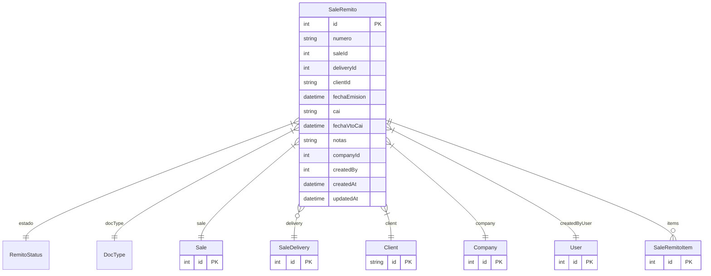

# SaleRemito

> Table name: `sale_remitos`

**Schema location:** Lines 9482-9523

## Fields

| Field | Type | Required | Unique | Default | Notes |
|-------|------|----------|--------|---------|-------|
| `id` | `Int` | ✅ | 🔑 PK | `autoincrement(` |  |
| `numero` | `String` | ✅ |  | `` | DB: VarChar(50) |
| `saleId` | `Int` | ✅ |  | `` |  |
| `deliveryId` | `Int?` | ❌ |  | `` |  |
| `clientId` | `String` | ✅ |  | `` |  |
| `fechaEmision` | `DateTime` | ✅ |  | `` | DB: Date |
| `cai` | `String?` | ❌ |  | `` | DB: VarChar(20). CAI si aplica |
| `fechaVtoCai` | `DateTime?` | ❌ |  | `` | DB: Date |
| `notas` | `String?` | ❌ |  | `` |  |
| `companyId` | `Int` | ✅ |  | `` | Tracking |
| `createdBy` | `Int` | ✅ |  | `` |  |
| `createdAt` | `DateTime` | ✅ |  | `now(` |  |
| `updatedAt` | `DateTime` | ✅ |  | `` |  |

## Relations

| Field | Type | Cardinality | FK Fields | References | On Delete |
|-------|------|-------------|-----------|------------|-----------|
| `estado` | [RemitoStatus](./models/RemitoStatus.md) | Many-to-One | - | - | - |
| `docType` | [DocType](./models/DocType.md) | Many-to-One | - | - | - |
| `sale` | [Sale](./models/Sale.md) | Many-to-One | saleId | id | - |
| `delivery` | [SaleDelivery](./models/SaleDelivery.md) | Many-to-One (optional) | deliveryId | id | - |
| `client` | [Client](./models/Client.md) | Many-to-One | clientId | id | - |
| `company` | [Company](./models/Company.md) | Many-to-One | companyId | id | Cascade |
| `createdByUser` | [User](./models/User.md) | Many-to-One | createdBy | id | - |
| `items` | [SaleRemitoItem](./models/SaleRemitoItem.md) | One-to-Many | - | - | - |

## Referenced By

| Model | Field | Cardinality |
|-------|-------|-------------|
| [Company](./models/Company.md) | `saleRemitos` | Has many |
| [User](./models/User.md) | `remitosCreated` | Has many |
| [Client](./models/Client.md) | `remitos` | Has many |
| [Sale](./models/Sale.md) | `remitos` | Has many |
| [SaleDelivery](./models/SaleDelivery.md) | `remitos` | Has many |
| [SaleRemitoItem](./models/SaleRemitoItem.md) | `remito` | Has one |

## Indexes

- `companyId`
- `saleId`
- `deliveryId`
- `clientId`
- `estado`
- `docType`

## Unique Constraints

- `companyId, numero`

## Entity Diagram

