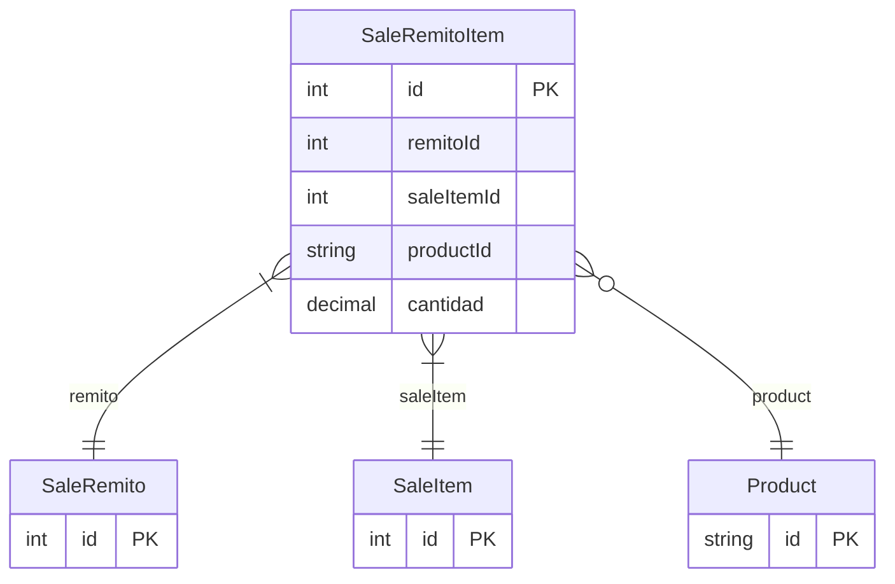

# SaleRemitoItem

> Table name: `sale_remito_items`

**Schema location:** Lines 9525-9539

## Fields

| Field | Type | Required | Unique | Default | Notes |
|-------|------|----------|--------|---------|-------|
| `id` | `Int` | ✅ | 🔑 PK | `autoincrement(` |  |
| `remitoId` | `Int` | ✅ |  | `` |  |
| `saleItemId` | `Int` | ✅ |  | `` |  |
| `productId` | `String?` | ❌ |  | `` |  |
| `cantidad` | `Decimal` | ✅ |  | `` | DB: Decimal(15, 4) |

## Relations

| Field | Type | Cardinality | FK Fields | References | On Delete |
|-------|------|-------------|-----------|------------|-----------|
| `remito` | [SaleRemito](./models/SaleRemito.md) | Many-to-One | remitoId | id | Cascade |
| `saleItem` | [SaleItem](./models/SaleItem.md) | Many-to-One | saleItemId | id | - |
| `product` | [Product](./models/Product.md) | Many-to-One (optional) | productId | id | - |

## Referenced By

| Model | Field | Cardinality |
|-------|-------|-------------|
| [Product](./models/Product.md) | `remitoItems` | Has many |
| [SaleItem](./models/SaleItem.md) | `remitoItems` | Has many |
| [SaleRemito](./models/SaleRemito.md) | `items` | Has many |

## Indexes

- `remitoId`
- `saleItemId`

## Entity Diagram

