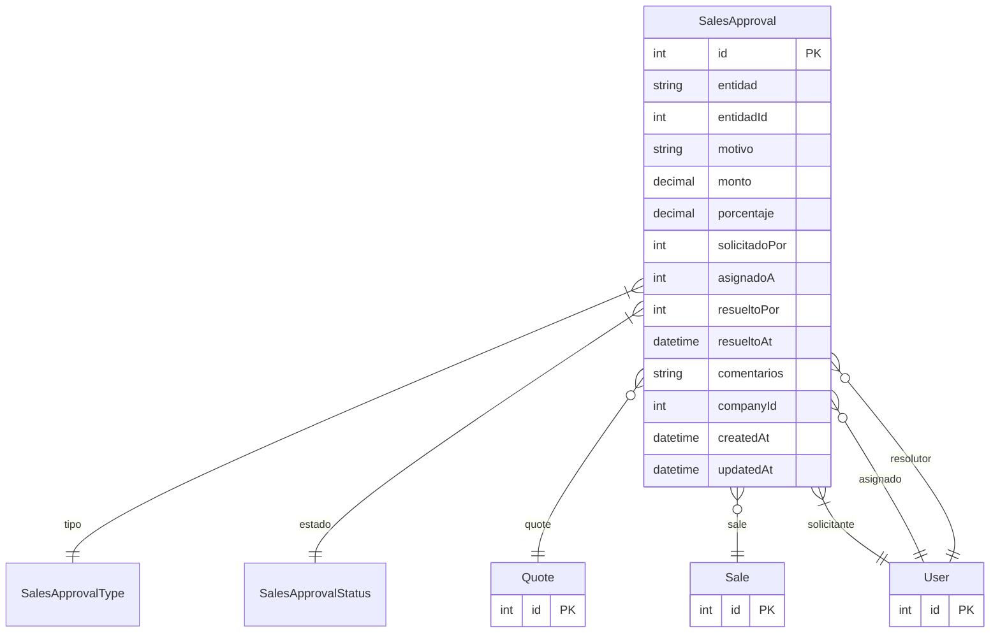

# SalesApproval

> Table name: `sales_approvals`

**Schema location:** Lines 9985-10017

## Fields

| Field | Type | Required | Unique | Default | Notes |
|-------|------|----------|--------|---------|-------|
| `id` | `Int` | ✅ | 🔑 PK | `autoincrement(` |  |
| `entidad` | `String` | ✅ |  | `` | DB: VarChar(50) |
| `entidadId` | `Int` | ✅ |  | `` |  |
| `motivo` | `String?` | ❌ |  | `` |  |
| `monto` | `Decimal?` | ❌ |  | `` | DB: Decimal(15, 2) |
| `porcentaje` | `Decimal?` | ❌ |  | `` | DB: Decimal(5, 2) |
| `solicitadoPor` | `Int` | ✅ |  | `` |  |
| `asignadoA` | `Int?` | ❌ |  | `` |  |
| `resueltoPor` | `Int?` | ❌ |  | `` |  |
| `resueltoAt` | `DateTime?` | ❌ |  | `` |  |
| `comentarios` | `String?` | ❌ |  | `` |  |
| `companyId` | `Int` | ✅ |  | `` |  |
| `createdAt` | `DateTime` | ✅ |  | `now(` |  |
| `updatedAt` | `DateTime` | ✅ |  | `` |  |

## Relations

| Field | Type | Cardinality | FK Fields | References | On Delete |
|-------|------|-------------|-----------|------------|-----------|
| `tipo` | [SalesApprovalType](./models/SalesApprovalType.md) | Many-to-One | - | - | - |
| `estado` | [SalesApprovalStatus](./models/SalesApprovalStatus.md) | Many-to-One | - | - | - |
| `quote` | [Quote](./models/Quote.md) | Many-to-One (optional) | entidadId | id | - |
| `sale` | [Sale](./models/Sale.md) | Many-to-One (optional) | entidadId | id | - |
| `solicitante` | [User](./models/User.md) | Many-to-One | solicitadoPor | id | - |
| `asignado` | [User](./models/User.md) | Many-to-One (optional) | asignadoA | id | - |
| `resolutor` | [User](./models/User.md) | Many-to-One (optional) | resueltoPor | id | - |

## Referenced By

| Model | Field | Cardinality |
|-------|-------|-------------|
| [User](./models/User.md) | `salesApprovalsSolicited` | Has many |
| [User](./models/User.md) | `salesApprovalsAssigned` | Has many |
| [User](./models/User.md) | `salesApprovalsResolved` | Has many |
| [Quote](./models/Quote.md) | `approvals` | Has many |
| [Sale](./models/Sale.md) | `approvals` | Has many |

## Indexes

- `companyId`
- `entidad, entidadId`
- `estado`

## Entity Diagram

