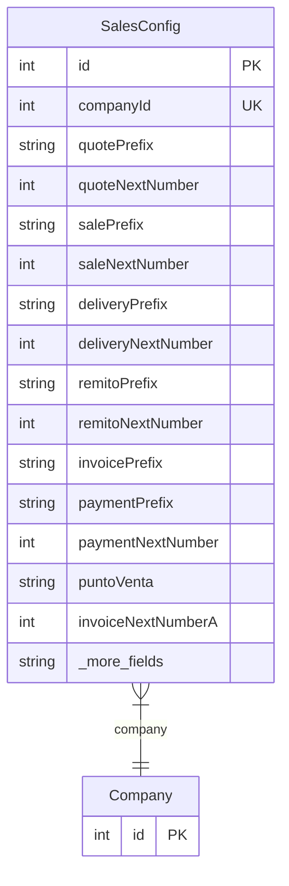

# SalesConfig

> Table name: `sales_config`

**Schema location:** Lines 8345-8651

## Fields

| Field | Type | Required | Unique | Default | Notes |
|-------|------|----------|--------|---------|-------|
| `id` | `Int` | ✅ | 🔑 PK | `autoincrement(` |  |
| `companyId` | `Int` | ✅ | ✅ | `` |  |
| `quotePrefix` | `String` | ✅ |  | `"COT"` | DB: VarChar(10). Numeración automática |
| `quoteNextNumber` | `Int` | ✅ |  | `1` |  |
| `salePrefix` | `String` | ✅ |  | `"VTA"` | DB: VarChar(10) |
| `saleNextNumber` | `Int` | ✅ |  | `1` |  |
| `deliveryPrefix` | `String` | ✅ |  | `"ENT"` | DB: VarChar(10) |
| `deliveryNextNumber` | `Int` | ✅ |  | `1` |  |
| `remitoPrefix` | `String` | ✅ |  | `"REM"` | DB: VarChar(10) |
| `remitoNextNumber` | `Int` | ✅ |  | `1` |  |
| `invoicePrefix` | `String` | ✅ |  | `"FA"` | DB: VarChar(10) |
| `paymentPrefix` | `String` | ✅ |  | `"REC"` | DB: VarChar(10) |
| `paymentNextNumber` | `Int` | ✅ |  | `1` |  |
| `puntoVenta` | `String` | ✅ |  | `"0001"` | DB: VarChar(5). Punto de venta para facturas |
| `invoiceNextNumberA` | `Int` | ✅ |  | `1` |  |
| `invoiceNextNumberB` | `Int` | ✅ |  | `1` |  |
| `invoiceNextNumberC` | `Int` | ✅ |  | `1` |  |
| `requiereAprobacionCotizacion` | `Boolean` | ✅ |  | `false` | Aprobaciones |
| `montoMinimoAprobacionCot` | `Decimal?` | ❌ |  | `` | DB: Decimal(15, 2) |
| `requiereAprobacionDescuento` | `Boolean` | ✅ |  | `true` |  |
| `maxDescuentoSinAprobacion` | `Decimal` | ✅ |  | `10` | DB: Decimal(5, 2) |
| `validarLimiteCredito` | `Boolean` | ✅ |  | `true` | Crédito |
| `bloquearVentaSinCredito` | `Boolean` | ✅ |  | `false` |  |
| `diasVencimientoDefault` | `Int` | ✅ |  | `30` |  |
| `validarStockDisponible` | `Boolean` | ✅ |  | `true` | Stock |
| `permitirVentaSinStock` | `Boolean` | ✅ |  | `true` | Alertas pero flexible |
| `reservarStockEnCotizacion` | `Boolean` | ✅ |  | `false` |  |
| `decrementarStockEnConfirmacion` | `Boolean` | ✅ |  | `true` | Decrementar stock al confirmar orden |
| `margenMinimoPermitido` | `Decimal` | ✅ |  | `10` | DB: Decimal(5, 2). Márgenes |
| `alertarMargenBajo` | `Boolean` | ✅ |  | `true` |  |
| `pricingMethod` | `String` | ✅ |  | `"LIST"` | DB: VarChar(20). LIST, MARGIN, DISCOUNT |
| `showCostsInQuotes` | `Boolean` | ✅ |  | `false` | Mostrar costos en cotizaciones |
| `showMarginsInQuotes` | `Boolean` | ✅ |  | `false` | Mostrar márgenes en cotizaciones |
| `comisionVendedorDefault` | `Decimal` | ✅ |  | `0` | DB: Decimal(5, 2). Comisiones |
| `tasaIvaDefault` | `Decimal` | ✅ |  | `21` | DB: Decimal(5, 2). IVA |
| `diasValidezCotizacion` | `Int` | ✅ |  | `30` | Validez cotización |
| `ivaRates` | `Json` | ✅ |  | `"[21, 10.5, 27, 0]"` | Alícuotas IVA permitidas (JSON array) |
| `percepcionIvaHabilitada` | `Boolean` | ✅ |  | `false` | Percepciones |
| `percepcionIvaTasa` | `Decimal?` | ❌ |  | `` | DB: Decimal(5, 2) |
| `percepcionIIBBHabilitada` | `Boolean` | ✅ |  | `false` |  |
| `percepcionIIBBTasa` | `Decimal?` | ❌ |  | `` | DB: Decimal(5, 2) |
| `diasVencimientoFacturaDefault` | `Int` | ✅ |  | `30` | Facturas |
| `diasRecordatorioFactura` | `Int` | ✅ |  | `5` |  |
| `enableBlockByOverdue` | `Boolean` | ✅ |  | `false` | Bloqueo por mora |
| `overdueGraceDays` | `Int` | ✅ |  | `0` |  |
| `enableAging` | `Boolean` | ✅ |  | `true` | Aging (envejecimiento de deuda) |
| `agingBuckets` | `Json` | ✅ |  | `"[30, 60, 90, 120]"` |  |
| `creditAlertThreshold` | `Decimal` | ✅ |  | `80` | DB: Decimal(5, 2). Alertas de crédito |
| `enableCheckLimit` | `Boolean` | ✅ |  | `true` | Límite de cheques |
| `defaultCheckLimit` | `Decimal?` | ❌ |  | `` | DB: Decimal(15, 2) |
| `marginRequiresApproval` | `Boolean` | ✅ |  | `false` |  |
| `marginApprovalThreshold` | `Decimal?` | ❌ |  | `` | DB: Decimal(5, 2) |
| `monedasHabilitadas` | `Json` | ✅ |  | `"[\"ARS\", \"USD\"]"` |  |
| `monedaPrincipal` | `String` | ✅ |  | `"ARS"` | DB: VarChar(10) |
| `permiteCambioMoneda` | `Boolean` | ✅ |  | `true` |  |
| `descuentoMaximoAutomatico` | `Decimal` | ✅ |  | `5` | DB: Decimal(5, 2) |
| `descuentoMaximoConAprobacion` | `Decimal` | ✅ |  | `20` | DB: Decimal(5, 2) |
| `productCostUpdateMode` | `String` | ✅ |  | `"MANUAL"` | DB: VarChar(20). Modo de actualización de costos: MANUAL, AUTO, WEIGHTED_AVG |
| `marginMinRequiredForSale` | `Decimal?` | ❌ |  | `` | DB: Decimal(5, 2) |
| `showCostInProductList` | `Boolean` | ✅ |  | `false` |  |
| `requireProductCodeUnique` | `Boolean` | ✅ |  | `true` |  |
| `turnoCapacidadMaximaDefault` | `Int` | ✅ |  | `1` |  |
| `turnoHoraInicioDefault` | `String` | ✅ |  | `"08:00"` | DB: VarChar(5) |
| `turnoHoraFinDefault` | `String` | ✅ |  | `"18:00"` | DB: VarChar(5) |
| `rutaMaxParadas` | `Int` | ✅ |  | `15` |  |
| `rutaMaxDistanciaKm` | `Decimal` | ✅ |  | `5` | DB: Decimal(10, 2) |
| `portalEnabled` | `Boolean` | ✅ |  | `false` | Portal del Cliente |
| `portalShowStock` | `Boolean` | ✅ |  | `false` |  |
| `portalShowOriginalPrice` | `Boolean` | ✅ |  | `true` |  |
| `portalAutoApproveOrders` | `Boolean` | ✅ |  | `false` |  |
| `portalOrderMinAmount` | `Decimal?` | ❌ |  | `` | DB: Decimal(15, 2) |
| `portalSessionDays` | `Int` | ✅ |  | `7` |  |
| `portalInviteExpiryHours` | `Int` | ✅ |  | `48` |  |
| `portalWelcomeMessage` | `String?` | ❌ |  | `` |  |
| `portalNotifyEmails` | `String?` | ❌ |  | `` |  |
| `portalRequireApprovalAbove` | `Decimal?` | ❌ |  | `` | DB: Decimal(15, 2) |
| `habilitarAcopios` | `Boolean` | ✅ |  | `true` | Acopios |
| `acopioPrefix` | `String` | ✅ |  | `"ACO"` | DB: VarChar(10) |
| `acopioNextNumber` | `Int` | ✅ |  | `1` |  |
| `retiroPrefix` | `String` | ✅ |  | `"RET"` | DB: VarChar(10) |
| `retiroNextNumber` | `Int` | ✅ |  | `1` |  |
| `diasAlertaAcopioDefault` | `Int` | ✅ |  | `30` | Días antes de vencer para alertar |
| `diasVencimientoAcopioDefault` | `Int` | ✅ |  | `90` | Días hasta vencimiento |
| `bloquearVentaAcopioExcedido` | `Boolean` | ✅ |  | `false` |  |
| `alertarAcopioExcedido` | `Boolean` | ✅ |  | `true` |  |
| `clientFormEnabledFields` | `Json` | ✅ |  | `"{}"` | Ejemplo: {"whatsapp": true, "visitDays": true, "taxExemptions": false} |
| `maxClientFormFeatures` | `Int?` | ❌ |  | `` | null = sin límite (puede habilitar todas) |
| `requiereAprobacionPagos` | `Boolean` | ✅ |  | `false` | Payment approval workflow |
| `requiereAprobacionPagosMontoMinimo` | `Decimal?` | ❌ |  | `` | DB: Decimal(15, 2) |
| `aprobacionPagosTiposRequieren` | `String?` | ❌ |  | `` | JSON array: ["CHEQUE","ECHEQ"] |
| `requiereAprobacionFacturas` | `Boolean` | ✅ |  | `false` | Invoice approval workflow |
| `requiereAprobacionFacturasMontoMinimo` | `Decimal?` | ❌ |  | `` | DB: Decimal(15, 2) |
| `requiereConfirmacionOrden` | `Boolean` | ✅ |  | `true` | Sales order confirmation |
| `permitirOrdenSinStock` | `Boolean` | ✅ |  | `true` |  |
| `permitirOrdenSinCredito` | `Boolean` | ✅ |  | `false` |  |
| `notificarNuevaCotizacion` | `Boolean` | ✅ |  | `true` | Notification settings |
| `notificarOrdenConfirmada` | `Boolean` | ✅ |  | `true` |  |
| `notificarEntregaProgramada` | `Boolean` | ✅ |  | `true` |  |
| `notificarFacturaEmitida` | `Boolean` | ✅ |  | `true` |  |
| `notificarPagoRecibido` | `Boolean` | ✅ |  | `true` |  |
| `emailsNotificaciones` | `String?` | ❌ |  | `` | Comma-separated |
| `enableCollectionReminders` | `Boolean` | ✅ |  | `false` | ═══════════════════════════════════════════════════════════════════════ |
| `reminderDaysBefore` | `Int` | ✅ |  | `3` | Days before due date to send first reminder |
| `reminderEscalationDays` | `Int` | ✅ |  | `7` | Days between escalation reminders |
| `enableSmartCollections` | `Boolean` | ✅ |  | `false` |  |
| `enablePaymentAnomalyDetect` | `Boolean` | ✅ |  | `false` |  |
| `moduloCotizacionesHabilitado` | `Boolean` | ✅ |  | `true` | Module enablement (some companies may not use all modules) |
| `moduloOrdenesHabilitado` | `Boolean` | ✅ |  | `true` |  |
| `moduloEntregasHabilitado` | `Boolean` | ✅ |  | `true` |  |
| `moduloFacturasHabilitado` | `Boolean` | ✅ |  | `true` |  |
| `moduloCobranzasHabilitado` | `Boolean` | ✅ |  | `true` |  |
| `moduloRemitosHabilitado` | `Boolean` | ✅ |  | `true` |  |
| `moduloNotasCreditoHabilitado` | `Boolean` | ✅ |  | `true` |  |
| `moduloTurnosHabilitado` | `Boolean` | ✅ |  | `false` |  |
| `moduloDisputasHabilitado` | `Boolean` | ✅ |  | `false` |  |
| `moduloValoresHabilitado` | `Boolean` | ✅ |  | `true` |  |
| `requiereConductorEnDespacho` | `Boolean` | ✅ |  | `false` | Delivery/logistics requirements |
| `requiereVehiculoEnDespacho` | `Boolean` | ✅ |  | `false` |  |
| `requiereEvidenciaEntrega` | `Boolean` | ✅ |  | `false` |  |
| `deliverySlaPreparacionMaxHoras` | `Int` | ✅ |  | `24` | SLA (Service Level Agreements) - Max hours per stage |
| `deliverySlaTransitoMaxHoras` | `Int` | ✅ |  | `48` |  |
| `deliverySlaAlertaRetrasoHoras` | `Int` | ✅ |  | `2` |  |
| `deliveryNotificationTemplates` | `Json` | ✅ |  | `"{\"dispatched\": \"¡Tu pedido #{deliveryNumber} está en camino! 🚚\\nConductor: {driverName}\\nTracking: {trackingLink}\", \"delivered\": \"✅ Tu pedido #{deliveryNumber} ha sido entregado.\\n¡Gracias por tu compra!\", \"failed\": \"⚠️ No pudimos entregar tu pedido #{deliveryNumber}.\\nMotivo: {reason}\\nNos contactaremos pronto.\", \"retry\": \"🔄 Reintentaremos la entrega de tu pedido #{deliveryNumber}.\\nNueva fecha: {newDate}\"}"` | Notification Templates (customizable messages) |
| `deliveryOptionalStates` | `Json` | ✅ |  | `"[]"` | States that can be skipped |
| `permitirEntregaSinOrden` | `Boolean` | ✅ |  | `false` |  |
| `deliveryTipoDefault` | `String` | ✅ |  | `"ENVIO"` | DB: VarChar(10). ENVIO or RETIRO |
| `requiereFirmaCliente` | `Boolean` | ✅ |  | `false` | Evidence Requirements |
| `requiereFotoEntrega` | `Boolean` | ✅ |  | `false` |  |
| `requiereDniReceptor` | `Boolean` | ✅ |  | `false` |  |
| `costoFleteDefault` | `Decimal` | ✅ |  | `0` | DB: Decimal(15, 2). Cost Configuration |
| `calcularFleteAutomatico` | `Boolean` | ✅ |  | `false` |  |
| `camposObligatoriosCotizacion` | `String?` | ❌ |  | `` | Document mandatory fields (JSON arrays) |
| `camposObligatoriosOrden` | `String?` | ❌ |  | `` |  |
| `camposObligatoriosFactura` | `String?` | ❌ |  | `` |  |
| `nivelEnforcementCredito` | `String` | ✅ |  | `"WARNING"` | DB: VarChar(20). STRICT, WARNING, DISABLED |
| `nivelEnforcementStock` | `String` | ✅ |  | `"WARNING"` | DB: VarChar(20). STRICT, WARNING, DISABLED |
| `quoteNotificationTemplates` | `Json` | ✅ |  | `"{}"` | ═══════════════════════════════════════════════════════════════════════ |
| `orderNotificationTemplates` | `Json` | ✅ |  | `"{}"` |  |
| `invoiceNotificationTemplates` | `Json` | ✅ |  | `"{}"` |  |
| `paymentNotificationTemplates` | `Json` | ✅ |  | `"{}"` |  |
| `collectionNotificationTemplates` | `Json` | ✅ |  | `"{}"` |  |
| `discountTiers` | `Json` | ✅ |  | `"[]"` | ═══════════════════════════════════════════════════════════════════════ |
| `commissionConfig` | `Json` | ✅ |  | `"{}"` | ═══════════════════════════════════════════════════════════════════════ |
| `numberFormatConfig` | `Json` | ✅ |  | `"{}"` | ═══════════════════════════════════════════════════════════════════════ |
| `quoteFollowupConfig` | `Json` | ✅ |  | `"{}"` | ═══════════════════════════════════════════════════════════════════════ |
| `segmentPricingConfig` | `Json` | ✅ |  | `"{}"` | ═══════════════════════════════════════════════════════════════════════ |
| `createdAt` | `DateTime` | ✅ |  | `now(` |  |
| `updatedAt` | `DateTime` | ✅ |  | `` |  |

## Relations

| Field | Type | Cardinality | FK Fields | References | On Delete |
|-------|------|-------------|-----------|------------|-----------|
| `company` | [Company](./models/Company.md) | Many-to-One | companyId | id | Cascade |

## Referenced By

| Model | Field | Cardinality |
|-------|-------|-------------|
| [Company](./models/Company.md) | `salesConfig` | Has one |

## Entity Diagram

