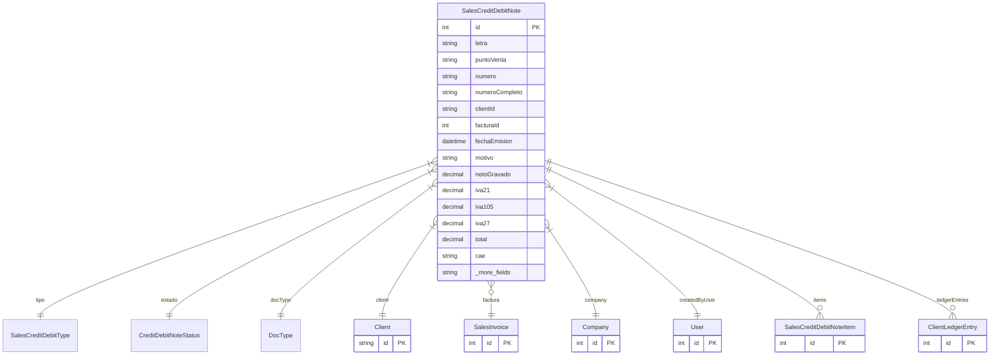

# SalesCreditDebitNote

> Table name: `sales_credit_debit_notes`

**Schema location:** Lines 9652-9709

## Fields

| Field | Type | Required | Unique | Default | Notes |
|-------|------|----------|--------|---------|-------|
| `id` | `Int` | ✅ | 🔑 PK | `autoincrement(` |  |
| `letra` | `String` | ✅ |  | `` | DB: VarChar(1) |
| `puntoVenta` | `String` | ✅ |  | `` | DB: VarChar(5) |
| `numero` | `String` | ✅ |  | `` | DB: VarChar(8) |
| `numeroCompleto` | `String` | ✅ |  | `` | DB: VarChar(20) |
| `clientId` | `String` | ✅ |  | `` |  |
| `facturaId` | `Int?` | ❌ |  | `` |  |
| `fechaEmision` | `DateTime` | ✅ |  | `` | DB: Date |
| `motivo` | `String` | ✅ |  | `` |  |
| `netoGravado` | `Decimal` | ✅ |  | `` | DB: Decimal(15, 2). Montos |
| `iva21` | `Decimal` | ✅ |  | `0` | DB: Decimal(15, 2) |
| `iva105` | `Decimal` | ✅ |  | `0` | DB: Decimal(15, 2) |
| `iva27` | `Decimal` | ✅ |  | `0` | DB: Decimal(15, 2) |
| `total` | `Decimal` | ✅ |  | `` | DB: Decimal(15, 2) |
| `cae` | `String?` | ❌ |  | `` | DB: VarChar(20). AFIP (preparado) |
| `fechaVtoCae` | `DateTime?` | ❌ |  | `` | DB: Date |
| `aplicada` | `Boolean` | ✅ |  | `false` | Aplicación |
| `aplicadaAt` | `DateTime?` | ❌ |  | `` |  |
| `notas` | `String?` | ❌ |  | `` | Notas |
| `companyId` | `Int` | ✅ |  | `` | Tracking |
| `createdBy` | `Int` | ✅ |  | `` |  |
| `createdAt` | `DateTime` | ✅ |  | `now(` |  |
| `updatedAt` | `DateTime` | ✅ |  | `` |  |

## Relations

| Field | Type | Cardinality | FK Fields | References | On Delete |
|-------|------|-------------|-----------|------------|-----------|
| `tipo` | [SalesCreditDebitType](./models/SalesCreditDebitType.md) | Many-to-One | - | - | - |
| `estado` | [CreditDebitNoteStatus](./models/CreditDebitNoteStatus.md) | Many-to-One | - | - | - |
| `docType` | [DocType](./models/DocType.md) | Many-to-One | - | - | - |
| `client` | [Client](./models/Client.md) | Many-to-One | clientId | id | - |
| `factura` | [SalesInvoice](./models/SalesInvoice.md) | Many-to-One (optional) | facturaId | id | - |
| `company` | [Company](./models/Company.md) | Many-to-One | companyId | id | Cascade |
| `createdByUser` | [User](./models/User.md) | Many-to-One | createdBy | id | - |
| `items` | [SalesCreditDebitNoteItem](./models/SalesCreditDebitNoteItem.md) | One-to-Many | - | - | - |
| `ledgerEntries` | [ClientLedgerEntry](./models/ClientLedgerEntry.md) | One-to-Many | - | - | - |

## Referenced By

| Model | Field | Cardinality |
|-------|-------|-------------|
| [Company](./models/Company.md) | `salesCreditDebitNotes` | Has many |
| [User](./models/User.md) | `creditNotesCreated` | Has many |
| [Client](./models/Client.md) | `creditDebitNotes` | Has many |
| [SalesInvoice](./models/SalesInvoice.md) | `creditNotes` | Has many |
| [SalesCreditDebitNoteItem](./models/SalesCreditDebitNoteItem.md) | `note` | Has one |
| [ClientLedgerEntry](./models/ClientLedgerEntry.md) | `notaCreditoDebito` | Has one |

## Indexes

- `companyId`
- `clientId`
- `facturaId`
- `tipo`
- `estado`
- `docType`

## Entity Diagram

