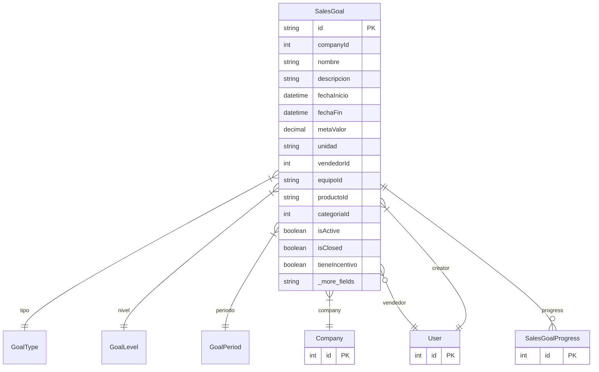

# SalesGoal

> Table name: `sales_goals`

**Schema location:** Lines 10292-10343

## Fields

| Field | Type | Required | Unique | Default | Notes |
|-------|------|----------|--------|---------|-------|
| `id` | `String` | ✅ | 🔑 PK | `cuid(` |  |
| `companyId` | `Int` | ✅ |  | `` |  |
| `nombre` | `String` | ✅ |  | `` |  |
| `descripcion` | `String?` | ❌ |  | `` | DB: Text |
| `fechaInicio` | `DateTime` | ✅ |  | `` | Fechas |
| `fechaFin` | `DateTime` | ✅ |  | `` |  |
| `metaValor` | `Decimal` | ✅ |  | `` | DB: Decimal(15, 2). Objetivo |
| `unidad` | `String?` | ❌ |  | `` | ARS, USD, unidades, % |
| `vendedorId` | `Int?` | ❌ |  | `` | Si es meta de vendedor |
| `equipoId` | `String?` | ❌ |  | `` | Si es meta de equipo |
| `productoId` | `String?` | ❌ |  | `` | Si es meta de producto |
| `categoriaId` | `Int?` | ❌ |  | `` | Si es meta de categoría |
| `isActive` | `Boolean` | ✅ |  | `true` | Estado |
| `isClosed` | `Boolean` | ✅ |  | `false` |  |
| `tieneIncentivo` | `Boolean` | ✅ |  | `false` | Incentivos |
| `incentivoPorcentaje` | `Decimal?` | ❌ |  | `` | DB: Decimal(5, 2) |
| `incentivoFijo` | `Decimal?` | ❌ |  | `` | DB: Decimal(15, 2) |
| `descripcionIncentivo` | `String?` | ❌ |  | `` | DB: Text |
| `createdBy` | `Int` | ✅ |  | `` |  |
| `createdAt` | `DateTime` | ✅ |  | `now(` |  |
| `updatedAt` | `DateTime` | ✅ |  | `` |  |

## Relations

| Field | Type | Cardinality | FK Fields | References | On Delete |
|-------|------|-------------|-----------|------------|-----------|
| `tipo` | [GoalType](./models/GoalType.md) | Many-to-One | - | - | - |
| `nivel` | [GoalLevel](./models/GoalLevel.md) | Many-to-One | - | - | - |
| `periodo` | [GoalPeriod](./models/GoalPeriod.md) | Many-to-One | - | - | - |
| `company` | [Company](./models/Company.md) | Many-to-One | companyId | id | Cascade |
| `vendedor` | [User](./models/User.md) | Many-to-One (optional) | vendedorId | id | - |
| `creator` | [User](./models/User.md) | Many-to-One | createdBy | id | - |
| `progress` | [SalesGoalProgress](./models/SalesGoalProgress.md) | One-to-Many | - | - | - |

## Referenced By

| Model | Field | Cardinality |
|-------|-------|-------------|
| [Company](./models/Company.md) | `salesGoals` | Has many |
| [User](./models/User.md) | `goalsAsignadas` | Has many |
| [User](./models/User.md) | `goalsCreadas` | Has many |
| [SalesGoalProgress](./models/SalesGoalProgress.md) | `goal` | Has one |

## Indexes

- `companyId`
- `vendedorId`
- `periodo`
- `fechaInicio, fechaFin`
- `isActive`

## Entity Diagram

