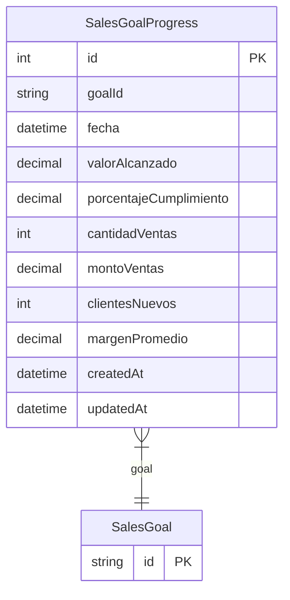

# SalesGoalProgress

> Table name: `sales_goal_progress`

**Schema location:** Lines 10346-10368

## Fields

| Field | Type | Required | Unique | Default | Notes |
|-------|------|----------|--------|---------|-------|
| `id` | `Int` | ✅ | 🔑 PK | `autoincrement(` |  |
| `goalId` | `String` | ✅ |  | `` |  |
| `fecha` | `DateTime` | ✅ |  | `` | DB: Date |
| `valorAlcanzado` | `Decimal` | ✅ |  | `` | DB: Decimal(15, 2) |
| `porcentajeCumplimiento` | `Decimal` | ✅ |  | `` | DB: Decimal(5, 2) |
| `cantidadVentas` | `Int?` | ❌ |  | `` | Detalles |
| `montoVentas` | `Decimal?` | ❌ |  | `` | DB: Decimal(15, 2) |
| `clientesNuevos` | `Int?` | ❌ |  | `` |  |
| `margenPromedio` | `Decimal?` | ❌ |  | `` | DB: Decimal(5, 2) |
| `createdAt` | `DateTime` | ✅ |  | `now(` |  |
| `updatedAt` | `DateTime` | ✅ |  | `` |  |

## Relations

| Field | Type | Cardinality | FK Fields | References | On Delete |
|-------|------|-------------|-----------|------------|-----------|
| `goal` | [SalesGoal](./models/SalesGoal.md) | Many-to-One | goalId | id | Cascade |

## Referenced By

| Model | Field | Cardinality |
|-------|-------|-------------|
| [SalesGoal](./models/SalesGoal.md) | `progress` | Has many |

## Indexes

- `goalId`
- `fecha`

## Unique Constraints

- `goalId, fecha`

## Entity Diagram

