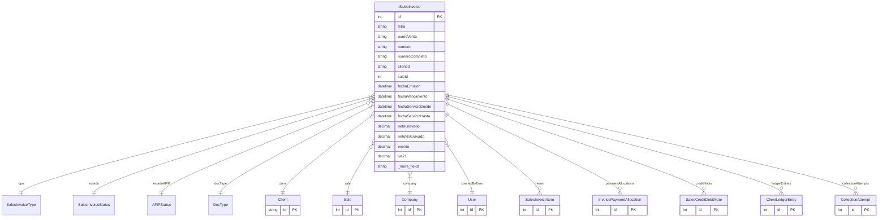

# SalesInvoice

> Table name: `sales_invoices`

**Schema location:** Lines 9542-9626

## Fields

| Field | Type | Required | Unique | Default | Notes |
|-------|------|----------|--------|---------|-------|
| `id` | `Int` | ✅ | 🔑 PK | `autoincrement(` |  |
| `letra` | `String` | ✅ |  | `` | DB: VarChar(1) |
| `puntoVenta` | `String` | ✅ |  | `` | DB: VarChar(5) |
| `numero` | `String` | ✅ |  | `` | DB: VarChar(8) |
| `numeroCompleto` | `String` | ✅ |  | `` | DB: VarChar(20) |
| `clientId` | `String` | ✅ |  | `` |  |
| `saleId` | `Int?` | ❌ |  | `` |  |
| `fechaEmision` | `DateTime` | ✅ |  | `` | DB: Date. Fechas |
| `fechaVencimiento` | `DateTime` | ✅ |  | `` | DB: Date |
| `fechaServicioDesde` | `DateTime?` | ❌ |  | `` | DB: Date |
| `fechaServicioHasta` | `DateTime?` | ❌ |  | `` | DB: Date |
| `netoGravado` | `Decimal` | ✅ |  | `` | DB: Decimal(15, 2). Montos |
| `netoNoGravado` | `Decimal` | ✅ |  | `0` | DB: Decimal(15, 2) |
| `exento` | `Decimal` | ✅ |  | `0` | DB: Decimal(15, 2) |
| `iva21` | `Decimal` | ✅ |  | `0` | DB: Decimal(15, 2) |
| `iva105` | `Decimal` | ✅ |  | `0` | DB: Decimal(15, 2) |
| `iva27` | `Decimal` | ✅ |  | `0` | DB: Decimal(15, 2) |
| `percepcionIVA` | `Decimal` | ✅ |  | `0` | DB: Decimal(15, 2) |
| `percepcionIIBB` | `Decimal` | ✅ |  | `0` | DB: Decimal(15, 2) |
| `otrosImpuestos` | `Decimal` | ✅ |  | `0` | DB: Decimal(15, 2) |
| `total` | `Decimal` | ✅ |  | `` | DB: Decimal(15, 2) |
| `moneda` | `String` | ✅ |  | `"ARS"` | DB: VarChar(10) |
| `tipoCambio` | `Decimal?` | ❌ |  | `` | DB: Decimal(15, 4) |
| `totalCobrado` | `Decimal` | ✅ |  | `0` | DB: Decimal(15, 2). Saldos |
| `saldoPendiente` | `Decimal` | ✅ |  | `` | DB: Decimal(15, 2) |
| `cae` | `String?` | ❌ |  | `` | DB: VarChar(20). AFIP (preparado pero no implementado) |
| `fechaVtoCae` | `DateTime?` | ❌ |  | `` | DB: Date |
| `condicionesPago` | `String?` | ❌ |  | `` | DB: VarChar(255). Condiciones |
| `notas` | `String?` | ❌ |  | `` | Notas |
| `notasInternas` | `String?` | ❌ |  | `` |  |
| `companyId` | `Int` | ✅ |  | `` | Tracking |
| `createdBy` | `Int` | ✅ |  | `` |  |
| `createdAt` | `DateTime` | ✅ |  | `now(` |  |
| `updatedAt` | `DateTime` | ✅ |  | `` |  |

## Relations

| Field | Type | Cardinality | FK Fields | References | On Delete |
|-------|------|-------------|-----------|------------|-----------|
| `tipo` | [SalesInvoiceType](./models/SalesInvoiceType.md) | Many-to-One | - | - | - |
| `estado` | [SalesInvoiceStatus](./models/SalesInvoiceStatus.md) | Many-to-One | - | - | - |
| `estadoAFIP` | [AFIPStatus](./models/AFIPStatus.md) | Many-to-One (optional) | - | - | - |
| `docType` | [DocType](./models/DocType.md) | Many-to-One | - | - | - |
| `client` | [Client](./models/Client.md) | Many-to-One | clientId | id | - |
| `sale` | [Sale](./models/Sale.md) | Many-to-One (optional) | saleId | id | - |
| `company` | [Company](./models/Company.md) | Many-to-One | companyId | id | Cascade |
| `createdByUser` | [User](./models/User.md) | Many-to-One | createdBy | id | - |
| `items` | [SalesInvoiceItem](./models/SalesInvoiceItem.md) | One-to-Many | - | - | - |
| `paymentAllocations` | [InvoicePaymentAllocation](./models/InvoicePaymentAllocation.md) | One-to-Many | - | - | - |
| `creditNotes` | [SalesCreditDebitNote](./models/SalesCreditDebitNote.md) | One-to-Many | - | - | - |
| `ledgerEntries` | [ClientLedgerEntry](./models/ClientLedgerEntry.md) | One-to-Many | - | - | - |
| `collectionAttempts` | [CollectionAttempt](./models/CollectionAttempt.md) | One-to-Many | - | - | - |

## Referenced By

| Model | Field | Cardinality |
|-------|-------|-------------|
| [Company](./models/Company.md) | `salesInvoices` | Has many |
| [User](./models/User.md) | `invoicesCreated` | Has many |
| [Client](./models/Client.md) | `invoices` | Has many |
| [Sale](./models/Sale.md) | `invoices` | Has many |
| [SalesInvoiceItem](./models/SalesInvoiceItem.md) | `invoice` | Has one |
| [SalesCreditDebitNote](./models/SalesCreditDebitNote.md) | `factura` | Has one |
| [InvoicePaymentAllocation](./models/InvoicePaymentAllocation.md) | `invoice` | Has one |
| [ClientLedgerEntry](./models/ClientLedgerEntry.md) | `factura` | Has one |
| [CollectionAttempt](./models/CollectionAttempt.md) | `invoice` | Has one |

## Indexes

- `companyId`
- `clientId`
- `saleId`
- `estado`
- `fechaEmision`
- `fechaVencimiento`
- `cae`
- `docType`
- `companyId, docType`
- `companyId, docType, fechaEmision`
- `companyId, clientId, estado`
- `companyId, estado, saldoPendiente`
- `clientId, estado, fechaVencimiento`

## Unique Constraints

- `companyId, tipo, puntoVenta, numero`

## Entity Diagram

