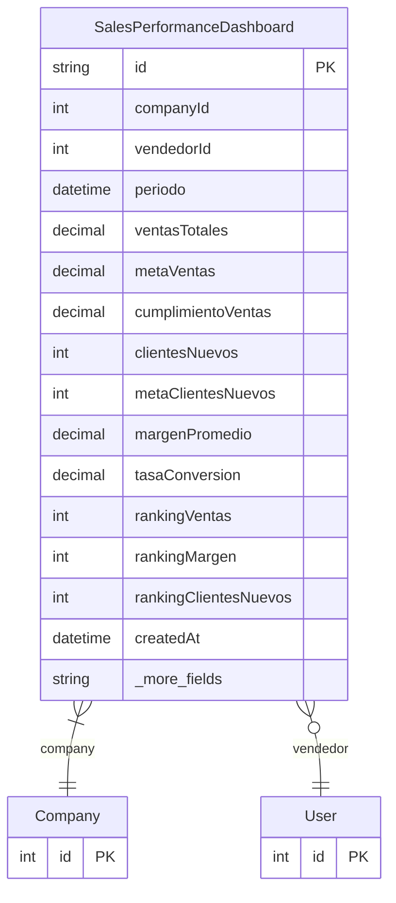

# SalesPerformanceDashboard

> Table name: `sales_performance_dashboard`

**Schema location:** Lines 10371-10403

## Fields

| Field | Type | Required | Unique | Default | Notes |
|-------|------|----------|--------|---------|-------|
| `id` | `String` | ✅ | 🔑 PK | `cuid(` |  |
| `companyId` | `Int` | ✅ |  | `` |  |
| `vendedorId` | `Int?` | ❌ |  | `` |  |
| `periodo` | `DateTime` | ✅ |  | `` | DB: Date. Primer día del mes |
| `ventasTotales` | `Decimal` | ✅ |  | `` | DB: Decimal(15, 2). Métricas generales |
| `metaVentas` | `Decimal` | ✅ |  | `` | DB: Decimal(15, 2) |
| `cumplimientoVentas` | `Decimal` | ✅ |  | `` | DB: Decimal(5, 2) |
| `clientesNuevos` | `Int` | ✅ |  | `` | Métricas adicionales |
| `metaClientesNuevos` | `Int` | ✅ |  | `` |  |
| `margenPromedio` | `Decimal` | ✅ |  | `` | DB: Decimal(5, 2) |
| `tasaConversion` | `Decimal` | ✅ |  | `` | DB: Decimal(5, 2) |
| `rankingVentas` | `Int?` | ❌ |  | `` | Rankings |
| `rankingMargen` | `Int?` | ❌ |  | `` |  |
| `rankingClientesNuevos` | `Int?` | ❌ |  | `` |  |
| `createdAt` | `DateTime` | ✅ |  | `now(` |  |
| `updatedAt` | `DateTime` | ✅ |  | `` |  |

## Relations

| Field | Type | Cardinality | FK Fields | References | On Delete |
|-------|------|-------------|-----------|------------|-----------|
| `company` | [Company](./models/Company.md) | Many-to-One | companyId | id | Cascade |
| `vendedor` | [User](./models/User.md) | Many-to-One (optional) | vendedorId | id | - |

## Referenced By

| Model | Field | Cardinality |
|-------|-------|-------------|
| [Company](./models/Company.md) | `performanceDashboards` | Has many |
| [User](./models/User.md) | `performanceDashboards` | Has many |

## Indexes

- `companyId, periodo`
- `vendedorId`

## Unique Constraints

- `companyId, vendedorId, periodo`

## Entity Diagram

