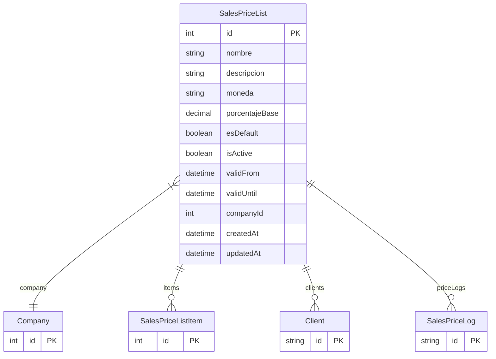

# SalesPriceList

> Table name: `sales_price_lists`

**Schema location:** Lines 9943-9966

## Fields

| Field | Type | Required | Unique | Default | Notes |
|-------|------|----------|--------|---------|-------|
| `id` | `Int` | ✅ | 🔑 PK | `autoincrement(` |  |
| `nombre` | `String` | ✅ |  | `` | DB: VarChar(100) |
| `descripcion` | `String?` | ❌ |  | `` |  |
| `moneda` | `String` | ✅ |  | `"ARS"` | DB: VarChar(10) |
| `porcentajeBase` | `Decimal?` | ❌ |  | `` | DB: Decimal(5, 2) |
| `esDefault` | `Boolean` | ✅ |  | `false` |  |
| `isActive` | `Boolean` | ✅ |  | `true` |  |
| `validFrom` | `DateTime?` | ❌ |  | `` | DB: Date |
| `validUntil` | `DateTime?` | ❌ |  | `` | DB: Date |
| `companyId` | `Int` | ✅ |  | `` |  |
| `createdAt` | `DateTime` | ✅ |  | `now(` |  |
| `updatedAt` | `DateTime` | ✅ |  | `` |  |

## Relations

| Field | Type | Cardinality | FK Fields | References | On Delete |
|-------|------|-------------|-----------|------------|-----------|
| `company` | [Company](./models/Company.md) | Many-to-One | companyId | id | Cascade |
| `items` | [SalesPriceListItem](./models/SalesPriceListItem.md) | One-to-Many | - | - | - |
| `clients` | [Client](./models/Client.md) | One-to-Many | - | - | - |
| `priceLogs` | [SalesPriceLog](./models/SalesPriceLog.md) | One-to-Many | - | - | - |

## Referenced By

| Model | Field | Cardinality |
|-------|-------|-------------|
| [Company](./models/Company.md) | `salesPriceLists` | Has many |
| [SalesPriceLog](./models/SalesPriceLog.md) | `salesPriceList` | Has one |
| [Client](./models/Client.md) | `defaultPriceList` | Has one |
| [SalesPriceListItem](./models/SalesPriceListItem.md) | `priceList` | Has one |

## Indexes

- `companyId`
- `isActive`

## Entity Diagram

