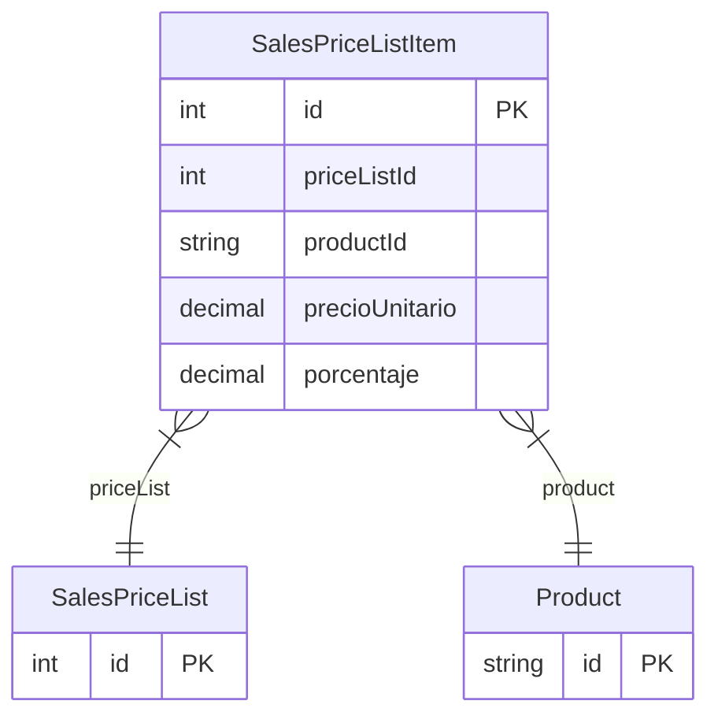

# SalesPriceListItem

> Table name: `sales_price_list_items`

**Schema location:** Lines 9968-9982

## Fields

| Field | Type | Required | Unique | Default | Notes |
|-------|------|----------|--------|---------|-------|
| `id` | `Int` | ✅ | 🔑 PK | `autoincrement(` |  |
| `priceListId` | `Int` | ✅ |  | `` |  |
| `productId` | `String` | ✅ |  | `` |  |
| `precioUnitario` | `Decimal` | ✅ |  | `` | DB: Decimal(15, 2) |
| `porcentaje` | `Decimal?` | ❌ |  | `` | DB: Decimal(5, 2) |

## Relations

| Field | Type | Cardinality | FK Fields | References | On Delete |
|-------|------|-------------|-----------|------------|-----------|
| `priceList` | [SalesPriceList](./models/SalesPriceList.md) | Many-to-One | priceListId | id | Cascade |
| `product` | [Product](./models/Product.md) | Many-to-One | productId | id | - |

## Referenced By

| Model | Field | Cardinality |
|-------|-------|-------------|
| [Product](./models/Product.md) | `priceListItems` | Has many |
| [SalesPriceList](./models/SalesPriceList.md) | `items` | Has many |

## Indexes

- `priceListId`
- `productId`

## Unique Constraints

- `priceListId, productId`

## Entity Diagram

