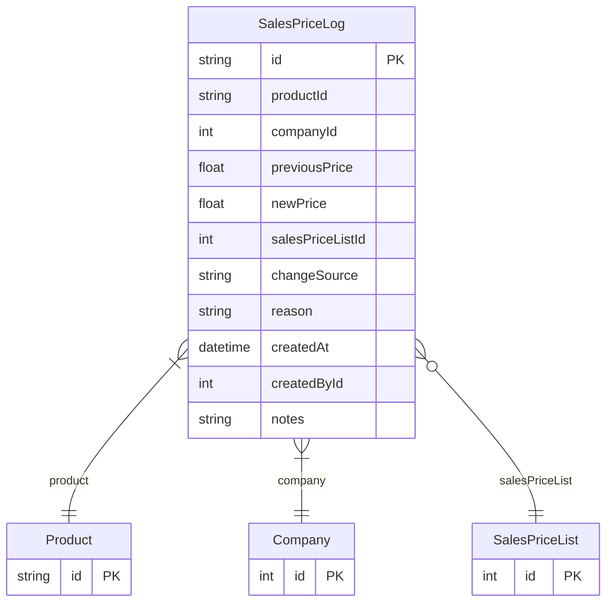

# SalesPriceLog

> Table name: `SalesPriceLog`

**Schema location:** Lines 2446-2474

## Fields

| Field | Type | Required | Unique | Default | Notes |
|-------|------|----------|--------|---------|-------|
| `id` | `String` | ✅ | 🔑 PK | `cuid(` |  |
| `productId` | `String` | ✅ |  | `` |  |
| `companyId` | `Int` | ✅ |  | `` |  |
| `previousPrice` | `Float?` | ❌ |  | `` | Valores del cambio |
| `newPrice` | `Float` | ✅ |  | `` |  |
| `salesPriceListId` | `Int?` | ❌ |  | `` | null cuando es cambio directo en Product.salePrice |
| `changeSource` | `String` | ✅ |  | `` | 'PRICE_LIST', 'PRODUCT_DIRECT', 'BULK_UPDATE', 'IMPORT' |
| `reason` | `String?` | ❌ |  | `` | Motivo del cambio |
| `createdAt` | `DateTime` | ✅ |  | `now(` | Metadata |
| `createdById` | `Int?` | ❌ |  | `` |  |
| `notes` | `String?` | ❌ |  | `` |  |

## Relations

| Field | Type | Cardinality | FK Fields | References | On Delete |
|-------|------|-------------|-----------|------------|-----------|
| `product` | [Product](./models/Product.md) | Many-to-One | productId | id | Cascade |
| `company` | [Company](./models/Company.md) | Many-to-One | companyId | id | Cascade |
| `salesPriceList` | [SalesPriceList](./models/SalesPriceList.md) | Many-to-One (optional) | salesPriceListId | id | SetNull |

## Referenced By

| Model | Field | Cardinality |
|-------|-------|-------------|
| [Company](./models/Company.md) | `salesPriceLogs` | Has many |
| [Product](./models/Product.md) | `salePriceLogs` | Has many |
| [SalesPriceList](./models/SalesPriceList.md) | `priceLogs` | Has many |

## Indexes

- `productId`
- `companyId, createdAt(sort: Desc)`
- `salesPriceListId`
- `changeSource`

## Entity Diagram

