# Sector

> Table name: `Sector`

**Schema location:** Lines 770-827

## Fields

| Field | Type | Required | Unique | Default | Notes |
|-------|------|----------|--------|---------|-------|
| `id` | `Int` | ✅ | 🔑 PK | `autoincrement(` |  |
| `name` | `String` | ✅ |  | `` |  |
| `description` | `String?` | ❌ |  | `` |  |
| `areaId` | `Int` | ✅ |  | `` |  |
| `companyId` | `Int` | ✅ |  | `` |  |
| `createdAt` | `DateTime` | ✅ |  | `now(` |  |
| `updatedAt` | `DateTime` | ✅ |  | `` |  |
| `imageUrl` | `String?` | ❌ |  | `` |  |
| `discordFallasWebhook` | `String?` | ❌ |  | `` | Webhook URL para canal de Fallas |
| `discordPreventivosWebhook` | `String?` | ❌ |  | `` | Webhook URL para canal de Preventivos |
| `discordOrdenesTrabajoWebhook` | `String?` | ❌ |  | `` | Webhook URL para canal de Órdenes de Trabajo |
| `discordResumenDiaWebhook` | `String?` | ❌ |  | `` | Webhook URL para canal de Resumen del día |
| `discordCategoryId` | `String?` | ❌ |  | `` | ID de la categoría del sector |
| `discordGeneralChannelId` | `String?` | ❌ |  | `` | ID del canal General (para resumen e inicio del día) |
| `discordFallasChannelId` | `String?` | ❌ |  | `` | ID del canal de Fallas |
| `discordPreventivosChannelId` | `String?` | ❌ |  | `` | ID del canal de Preventivos |
| `discordOTChannelId` | `String?` | ❌ |  | `` | ID del canal de Órdenes de Trabajo |
| `maintenance_configs` | `maintenance_configs[]` | ✅ |  | `` |  |
| `enabledForProduction` | `Boolean` | ✅ |  | `false` | Habilitar sector para Producción |

## Relations

| Field | Type | Cardinality | FK Fields | References | On Delete |
|-------|------|-------------|-----------|------------|-----------|
| `machines` | [Machine](./models/Machine.md) | One-to-Many | - | - | - |
| `roles` | [Role](./models/Role.md) | One-to-Many | - | - | - |
| `area` | [Area](./models/Area.md) | Many-to-One | areaId | id | Cascade |
| `company` | [Company](./models/Company.md) | Many-to-One | companyId | id | Cascade |
| `sectorTools` | [SectorTool](./models/SectorTool.md) | One-to-Many | - | - | - |
| `tools` | [Tool](./models/Tool.md) | One-to-Many | - | - | - |
| `unidadesMoviles` | [UnidadMovil](./models/UnidadMovil.md) | One-to-Many | - | - | - |
| `workStations` | [WorkStation](./models/WorkStation.md) | One-to-Many | - | - | - |
| `maintenanceChecklists` | [MaintenanceChecklist](./models/MaintenanceChecklist.md) | One-to-Many | - | - | - |
| `workOrders` | [WorkOrder](./models/WorkOrder.md) | One-to-Many | - | - | - |
| `workSectors` | [WorkSector](./models/WorkSector.md) | One-to-Many | - | - | - |
| `maintenanceBudgets` | [MaintenanceBudget](./models/MaintenanceBudget.md) | One-to-Many | - | - | - |
| `permitsToWork` | [PermitToWork](./models/PermitToWork.md) | One-to-Many | - | - | - |
| `plantZones` | [PlantZone](./models/PlantZone.md) | One-to-Many | - | - | - |
| `managementOfChanges` | [ManagementOfChange](./models/ManagementOfChange.md) | One-to-Many | - | - | - |
| `productionOrders` | [ProductionOrder](./models/ProductionOrder.md) | One-to-Many | - | - | - |
| `userDiscordAccess` | [UserDiscordAccess](./models/UserDiscordAccess.md) | One-to-Many | - | - | - |
| `routineTemplates` | [ProductionRoutineTemplate](./models/ProductionRoutineTemplate.md) | One-to-Many | - | - | - |
| `workPositions` | [WorkPosition](./models/WorkPosition.md) | One-to-Many | - | - | - |
| `productionProducts` | [Product](./models/Product.md) | One-to-Many | - | - | - |
| `dailyProductionSessions` | [DailyProductionSession](./models/DailyProductionSession.md) | One-to-Many | - | - | - |
| `dailyProductionEntries` | [DailyProductionEntry](./models/DailyProductionEntry.md) | One-to-Many | - | - | - |

## Referenced By

| Model | Field | Cardinality |
|-------|-------|-------------|
| [Company](./models/Company.md) | `sectors` | Has many |
| [Role](./models/Role.md) | `sector` | Has one |
| [UserDiscordAccess](./models/UserDiscordAccess.md) | `sector` | Has one |
| [Area](./models/Area.md) | `sectors` | Has many |
| [PlantZone](./models/PlantZone.md) | `sector` | Has one |
| [UnidadMovil](./models/UnidadMovil.md) | `sector` | Has one |
| [Machine](./models/Machine.md) | `sector` | Has one |
| [Tool](./models/Tool.md) | `sector` | Has one |
| [SectorTool](./models/SectorTool.md) | `sector` | Has one |
| [WorkOrder](./models/WorkOrder.md) | `sector` | Has one |
| [Product](./models/Product.md) | `productionSector` | Has one |
| [WorkStation](./models/WorkStation.md) | `sector` | Has one |
| [MaintenanceChecklist](./models/MaintenanceChecklist.md) | `sector` | Has one |
| [maintenance_configs](./models/maintenance_configs.md) | `Sector` | Has one |
| [WorkSector](./models/WorkSector.md) | `sourceSector` | Has one |
| [WorkPosition](./models/WorkPosition.md) | `sector` | Has one |
| [MaintenanceBudget](./models/MaintenanceBudget.md) | `sector` | Has one |
| [PermitToWork](./models/PermitToWork.md) | `sector` | Has one |
| [ManagementOfChange](./models/ManagementOfChange.md) | `sector` | Has one |
| [ProductionOrder](./models/ProductionOrder.md) | `sector` | Has one |
| [ProductionRoutineTemplate](./models/ProductionRoutineTemplate.md) | `sector` | Has one |
| [DailyProductionSession](./models/DailyProductionSession.md) | `sector` | Has one |
| [DailyProductionEntry](./models/DailyProductionEntry.md) | `sector` | Has one |

## Entity Diagram

```mermaid
erDiagram
    Sector {
        int id PK
        string name
        string description
        int areaId
        int companyId
        datetime createdAt
        datetime updatedAt
        string imageUrl
        string discordFallasWebhook
        string discordPreventivosWebhook
        string discordOrdenesTrabajoWebhook
        string discordResumenDiaWebhook
        string discordCategoryId
        string discordGeneralChannelId
        string discordFallasChannelId
        string _more_fields
    }
    Machine {
        int id PK
    }
    Role {
        int id PK
    }
    Area {
        int id PK
    }
    Company {
        int id PK
    }
    SectorTool {
        int id PK
    }
    Tool {
        int id PK
    }
    UnidadMovil {
        int id PK
    }
    WorkStation {
        int id PK
    }
    MaintenanceChecklist {
        int id PK
    }
    WorkOrder {
        int id PK
    }
    WorkSector {
        int id PK
    }
    MaintenanceBudget {
        int id PK
    }
    PermitToWork {
        int id PK
    }
    PlantZone {
        int id PK
    }
    ManagementOfChange {
        int id PK
    }
    ProductionOrder {
        int id PK
    }
    UserDiscordAccess {
        int id PK
    }
    ProductionRoutineTemplate {
        int id PK
    }
    WorkPosition {
        int id PK
    }
    Product {
        string id PK
    }
    DailyProductionSession {
        int id PK
    }
    DailyProductionEntry {
        int id PK
    }
    maintenance_configs {
        int id PK
    }
    Sector ||--o{ Machine : "machines"
    Sector ||--o{ Role : "roles"
    Sector }|--|| Area : "area"
    Sector }|--|| Company : "company"
    Sector ||--o{ SectorTool : "sectorTools"
    Sector ||--o{ Tool : "tools"
    Sector ||--o{ UnidadMovil : "unidadesMoviles"
    Sector ||--o{ WorkStation : "workStations"
    Sector ||--o{ MaintenanceChecklist : "maintenanceChecklists"
    Sector ||--o{ WorkOrder : "workOrders"
    Sector ||--o{ WorkSector : "workSectors"
    Sector ||--o{ MaintenanceBudget : "maintenanceBudgets"
    Sector ||--o{ PermitToWork : "permitsToWork"
    Sector ||--o{ PlantZone : "plantZones"
    Sector ||--o{ ManagementOfChange : "managementOfChanges"
    Sector ||--o{ ProductionOrder : "productionOrders"
    Sector ||--o{ UserDiscordAccess : "userDiscordAccess"
    Sector ||--o{ ProductionRoutineTemplate : "routineTemplates"
    Sector ||--o{ WorkPosition : "workPositions"
    Sector ||--o{ Product : "productionProducts"
    Sector ||--o{ DailyProductionSession : "dailyProductionSessions"
    Sector ||--o{ DailyProductionEntry : "dailyProductionEntries"
```

