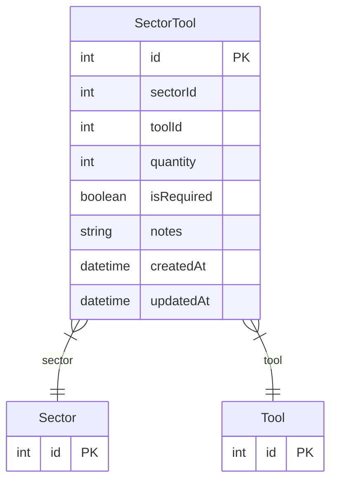

# SectorTool

> Table name: `SectorTool`

**Schema location:** Lines 1409-1423

## Fields

| Field | Type | Required | Unique | Default | Notes |
|-------|------|----------|--------|---------|-------|
| `id` | `Int` | ✅ | 🔑 PK | `autoincrement(` |  |
| `sectorId` | `Int` | ✅ |  | `` |  |
| `toolId` | `Int` | ✅ |  | `` |  |
| `quantity` | `Int` | ✅ |  | `1` |  |
| `isRequired` | `Boolean` | ✅ |  | `true` |  |
| `notes` | `String?` | ❌ |  | `` |  |
| `createdAt` | `DateTime` | ✅ |  | `now(` |  |
| `updatedAt` | `DateTime` | ✅ |  | `` |  |

## Relations

| Field | Type | Cardinality | FK Fields | References | On Delete |
|-------|------|-------------|-----------|------------|-----------|
| `sector` | [Sector](./models/Sector.md) | Many-to-One | sectorId | id | Cascade |
| `tool` | [Tool](./models/Tool.md) | Many-to-One | toolId | id | Cascade |

## Referenced By

| Model | Field | Cardinality |
|-------|-------|-------------|
| [Sector](./models/Sector.md) | `sectorTools` | Has many |
| [Tool](./models/Tool.md) | `sectorTools` | Has many |

## Unique Constraints

- `sectorId, toolId`

## Entity Diagram

