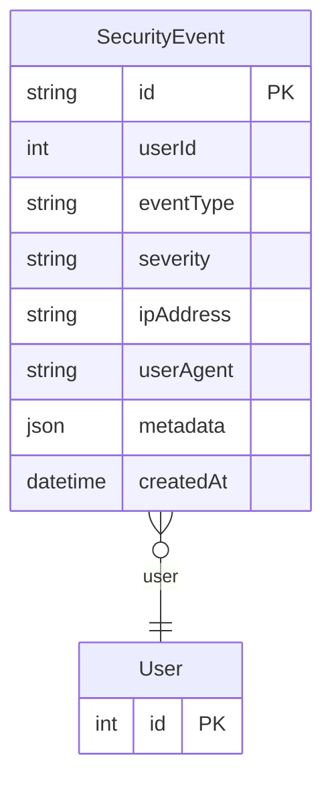

# SecurityEvent

> Table name: `security_events`

**Schema location:** Lines 8157-8172

## Fields

| Field | Type | Required | Unique | Default | Notes |
|-------|------|----------|--------|---------|-------|
| `id` | `String` | ✅ | 🔑 PK | `uuid(` |  |
| `userId` | `Int?` | ❌ |  | `` |  |
| `eventType` | `String` | ✅ |  | `` | "login" | "logout" | "password_change" | "2fa_enabled" | "2fa_disabled" | "session_revoked" | "suspicious_activity" |
| `severity` | `String` | ✅ |  | `` | "info" | "warning" | "critical" |
| `ipAddress` | `String?` | ❌ |  | `` |  |
| `userAgent` | `String?` | ❌ |  | `` |  |
| `metadata` | `Json?` | ❌ |  | `` | Datos adicionales del evento |
| `createdAt` | `DateTime` | ✅ |  | `now(` |  |

## Relations

| Field | Type | Cardinality | FK Fields | References | On Delete |
|-------|------|-------------|-----------|------------|-----------|
| `user` | [User](./models/User.md) | Many-to-One (optional) | userId | id | - |

## Referenced By

| Model | Field | Cardinality |
|-------|-------|-------------|
| [User](./models/User.md) | `securityEvents` | Has many |

## Indexes

- `userId, createdAt`
- `eventType, createdAt`
- `severity, createdAt`

## Entity Diagram

