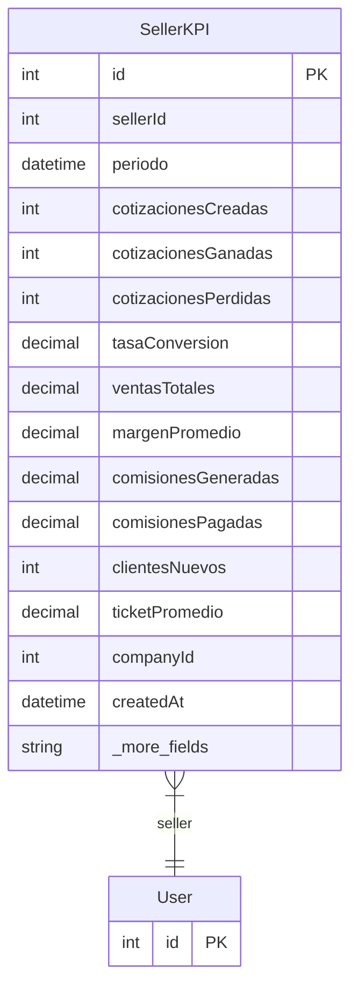

# SellerKPI

> Table name: `seller_kpis`

**Schema location:** Lines 10044-10075

## Fields

| Field | Type | Required | Unique | Default | Notes |
|-------|------|----------|--------|---------|-------|
| `id` | `Int` | ✅ | 🔑 PK | `autoincrement(` |  |
| `sellerId` | `Int` | ✅ |  | `` |  |
| `periodo` | `DateTime` | ✅ |  | `` | DB: Date |
| `cotizacionesCreadas` | `Int` | ✅ |  | `0` | Métricas |
| `cotizacionesGanadas` | `Int` | ✅ |  | `0` |  |
| `cotizacionesPerdidas` | `Int` | ✅ |  | `0` |  |
| `tasaConversion` | `Decimal` | ✅ |  | `0` | DB: Decimal(5, 2) |
| `ventasTotales` | `Decimal` | ✅ |  | `0` | DB: Decimal(15, 2) |
| `margenPromedio` | `Decimal` | ✅ |  | `0` | DB: Decimal(5, 2) |
| `comisionesGeneradas` | `Decimal` | ✅ |  | `0` | DB: Decimal(15, 2) |
| `comisionesPagadas` | `Decimal` | ✅ |  | `0` | DB: Decimal(15, 2) |
| `clientesNuevos` | `Int` | ✅ |  | `0` |  |
| `ticketPromedio` | `Decimal` | ✅ |  | `0` | DB: Decimal(15, 2) |
| `companyId` | `Int` | ✅ |  | `` |  |
| `createdAt` | `DateTime` | ✅ |  | `now(` |  |
| `updatedAt` | `DateTime` | ✅ |  | `` |  |

## Relations

| Field | Type | Cardinality | FK Fields | References | On Delete |
|-------|------|-------------|-----------|------------|-----------|
| `seller` | [User](./models/User.md) | Many-to-One | sellerId | id | - |

## Referenced By

| Model | Field | Cardinality |
|-------|-------|-------------|
| [User](./models/User.md) | `sellerKPIs` | Has many |

## Indexes

- `sellerId`
- `periodo`
- `companyId`

## Unique Constraints

- `sellerId, periodo, companyId`

## Entity Diagram

