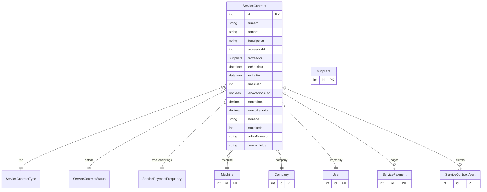

# ServiceContract

> Table name: `service_contracts`

**Schema location:** Lines 15070-15138

## Fields

| Field | Type | Required | Unique | Default | Notes |
|-------|------|----------|--------|---------|-------|
| `id` | `Int` | ✅ | 🔑 PK | `autoincrement(` |  |
| `numero` | `String` | ✅ |  | `` | DB: VarChar(50). Número de contrato/póliza |
| `nombre` | `String` | ✅ |  | `` | DB: VarChar(200). Nombre descriptivo |
| `descripcion` | `String?` | ❌ |  | `` |  |
| `proveedorId` | `Int` | ✅ |  | `` | Proveedor del servicio |
| `proveedor` | `suppliers` | ✅ |  | `` |  |
| `fechaInicio` | `DateTime` | ✅ |  | `` | DB: Date. Vigencia |
| `fechaFin` | `DateTime?` | ❌ |  | `` | DB: Date. Null = indefinido |
| `diasAviso` | `Int` | ✅ |  | `30` | Días antes de vencimiento para avisar |
| `renovacionAuto` | `Boolean` | ✅ |  | `false` |  |
| `montoTotal` | `Decimal?` | ❌ |  | `` | DB: Decimal(15, 2). Monto total del contrato |
| `montoPeriodo` | `Decimal?` | ❌ |  | `` | DB: Decimal(15, 2). Monto por período |
| `moneda` | `String` | ✅ |  | `"ARS"` | DB: VarChar(3) |
| `machineId` | `Int?` | ❌ |  | `` | Si es servicio/seguro de máquina |
| `polizaNumero` | `String?` | ❌ |  | `` | DB: VarChar(100). Número de póliza (seguros) |
| `aseguradora` | `String?` | ❌ |  | `` | DB: VarChar(200). Nombre de aseguradora |
| `cobertura` | `String?` | ❌ |  | `` | Detalle de cobertura |
| `sumaAsegurada` | `Decimal?` | ❌ |  | `` | DB: Decimal(15, 2) |
| `deducible` | `Decimal?` | ❌ |  | `` | DB: Decimal(15, 2) |
| `franquicia` | `Decimal?` | ❌ |  | `` | DB: Decimal(15, 2) |
| `contactoNombre` | `String?` | ❌ |  | `` | DB: VarChar(200). Contactos |
| `contactoTelefono` | `String?` | ❌ |  | `` | DB: VarChar(50) |
| `contactoEmail` | `String?` | ❌ |  | `` | DB: VarChar(200) |
| `documentos` | `Json?` | ❌ |  | `` | Array de { nombre, url, tipo } |
| `notas` | `String?` | ❌ |  | `` | Notas |
| `companyId` | `Int` | ✅ |  | `` | Multi-tenant |
| `createdById` | `Int` | ✅ |  | `` | Auditoría |
| `createdAt` | `DateTime` | ✅ |  | `now(` |  |
| `updatedAt` | `DateTime` | ✅ |  | `` |  |

## Relations

| Field | Type | Cardinality | FK Fields | References | On Delete |
|-------|------|-------------|-----------|------------|-----------|
| `tipo` | [ServiceContractType](./models/ServiceContractType.md) | Many-to-One | - | - | - |
| `estado` | [ServiceContractStatus](./models/ServiceContractStatus.md) | Many-to-One | - | - | - |
| `frecuenciaPago` | [ServicePaymentFrequency](./models/ServicePaymentFrequency.md) | Many-to-One | - | - | - |
| `machine` | [Machine](./models/Machine.md) | Many-to-One (optional) | machineId | id | SetNull |
| `company` | [Company](./models/Company.md) | Many-to-One | companyId | id | Cascade |
| `createdBy` | [User](./models/User.md) | Many-to-One | createdById | id | - |
| `pagos` | [ServicePayment](./models/ServicePayment.md) | One-to-Many | - | - | - |
| `alertas` | [ServiceContractAlert](./models/ServiceContractAlert.md) | One-to-Many | - | - | - |

## Referenced By

| Model | Field | Cardinality |
|-------|-------|-------------|
| [Company](./models/Company.md) | `serviceContracts` | Has many |
| [User](./models/User.md) | `createdServiceContracts` | Has many |
| [Machine](./models/Machine.md) | `serviceContracts` | Has many |
| [suppliers](./models/suppliers.md) | `serviceContracts` | Has many |
| [ServicePayment](./models/ServicePayment.md) | `contract` | Has one |
| [ServiceContractAlert](./models/ServiceContractAlert.md) | `contract` | Has one |

## Indexes

- `companyId, estado`
- `companyId, tipo`
- `proveedorId`
- `machineId`
- `fechaFin`

## Unique Constraints

- `companyId, numero`

## Entity Diagram

