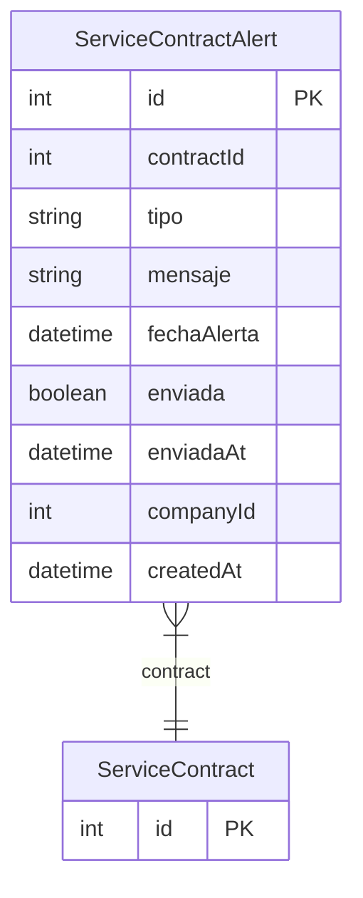

# ServiceContractAlert

> Table name: `service_contract_alerts`

**Schema location:** Lines 15174-15192

## Fields

| Field | Type | Required | Unique | Default | Notes |
|-------|------|----------|--------|---------|-------|
| `id` | `Int` | ✅ | 🔑 PK | `autoincrement(` |  |
| `contractId` | `Int` | ✅ |  | `` |  |
| `tipo` | `String` | ✅ |  | `` | VENCIMIENTO, PAGO_PENDIENTE, RENOVACION |
| `mensaje` | `String` | ✅ |  | `` |  |
| `fechaAlerta` | `DateTime` | ✅ |  | `` |  |
| `enviada` | `Boolean` | ✅ |  | `false` |  |
| `enviadaAt` | `DateTime?` | ❌ |  | `` |  |
| `companyId` | `Int` | ✅ |  | `` |  |
| `createdAt` | `DateTime` | ✅ |  | `now(` |  |

## Relations

| Field | Type | Cardinality | FK Fields | References | On Delete |
|-------|------|-------------|-----------|------------|-----------|
| `contract` | [ServiceContract](./models/ServiceContract.md) | Many-to-One | contractId | id | Cascade |

## Referenced By

| Model | Field | Cardinality |
|-------|-------|-------------|
| [ServiceContract](./models/ServiceContract.md) | `alertas` | Has many |

## Indexes

- `contractId`
- `companyId, enviada`
- `fechaAlerta`

## Entity Diagram

