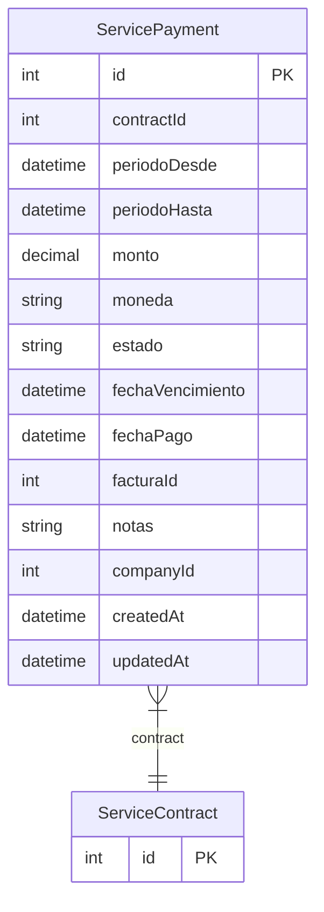

# ServicePayment

> Table name: `service_payments`

**Schema location:** Lines 15140-15172

## Fields

| Field | Type | Required | Unique | Default | Notes |
|-------|------|----------|--------|---------|-------|
| `id` | `Int` | ✅ | 🔑 PK | `autoincrement(` |  |
| `contractId` | `Int` | ✅ |  | `` |  |
| `periodoDesde` | `DateTime` | ✅ |  | `` | DB: Date. Período que cubre |
| `periodoHasta` | `DateTime` | ✅ |  | `` | DB: Date |
| `monto` | `Decimal` | ✅ |  | `` | DB: Decimal(15, 2). Monto |
| `moneda` | `String` | ✅ |  | `"ARS"` | DB: VarChar(3) |
| `estado` | `String` | ✅ |  | `"PENDIENTE"` | PENDIENTE, PAGADO, VENCIDO |
| `fechaVencimiento` | `DateTime` | ✅ |  | `` | DB: Date |
| `fechaPago` | `DateTime?` | ❌ |  | `` |  |
| `facturaId` | `Int?` | ❌ |  | `` | Referencia a factura (si se vinculó) |
| `notas` | `String?` | ❌ |  | `` | Notas |
| `companyId` | `Int` | ✅ |  | `` |  |
| `createdAt` | `DateTime` | ✅ |  | `now(` |  |
| `updatedAt` | `DateTime` | ✅ |  | `` |  |

## Relations

| Field | Type | Cardinality | FK Fields | References | On Delete |
|-------|------|-------------|-----------|------------|-----------|
| `contract` | [ServiceContract](./models/ServiceContract.md) | Many-to-One | contractId | id | Cascade |

## Referenced By

| Model | Field | Cardinality |
|-------|-------|-------------|
| [ServiceContract](./models/ServiceContract.md) | `pagos` | Has many |

## Indexes

- `contractId`
- `companyId, estado`
- `fechaVencimiento`

## Entity Diagram

