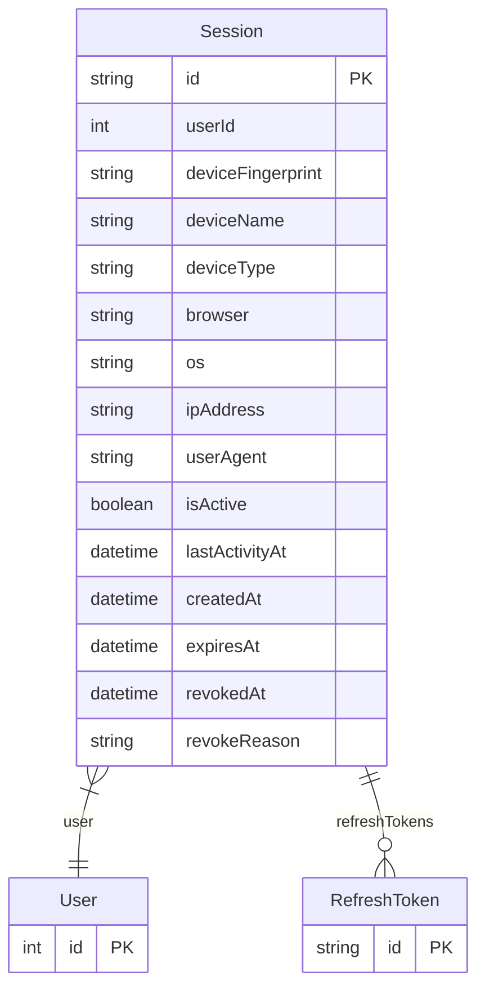

# Session

> Table name: `sessions`

**Schema location:** Lines 8064-8087

## Fields

| Field | Type | Required | Unique | Default | Notes |
|-------|------|----------|--------|---------|-------|
| `id` | `String` | ✅ | 🔑 PK | `uuid(` |  |
| `userId` | `Int` | ✅ |  | `` |  |
| `deviceFingerprint` | `String?` | ❌ |  | `` |  |
| `deviceName` | `String?` | ❌ |  | `` | "Chrome en Windows", "Safari en iPhone" |
| `deviceType` | `String?` | ❌ |  | `` | "desktop" | "mobile" | "tablet" |
| `browser` | `String?` | ❌ |  | `` |  |
| `os` | `String?` | ❌ |  | `` |  |
| `ipAddress` | `String?` | ❌ |  | `` |  |
| `userAgent` | `String?` | ❌ |  | `` |  |
| `isActive` | `Boolean` | ✅ |  | `true` |  |
| `lastActivityAt` | `DateTime` | ✅ |  | `now(` |  |
| `createdAt` | `DateTime` | ✅ |  | `now(` |  |
| `expiresAt` | `DateTime` | ✅ |  | `` |  |
| `revokedAt` | `DateTime?` | ❌ |  | `` |  |
| `revokeReason` | `String?` | ❌ |  | `` |  |

## Relations

| Field | Type | Cardinality | FK Fields | References | On Delete |
|-------|------|-------------|-----------|------------|-----------|
| `user` | [User](./models/User.md) | Many-to-One | userId | id | Cascade |
| `refreshTokens` | [RefreshToken](./models/RefreshToken.md) | One-to-Many | - | - | - |

## Referenced By

| Model | Field | Cardinality |
|-------|-------|-------------|
| [User](./models/User.md) | `sessions` | Has many |
| [RefreshToken](./models/RefreshToken.md) | `session` | Has one |

## Indexes

- `userId, isActive`
- `expiresAt`
- `deviceFingerprint`

## Entity Diagram

