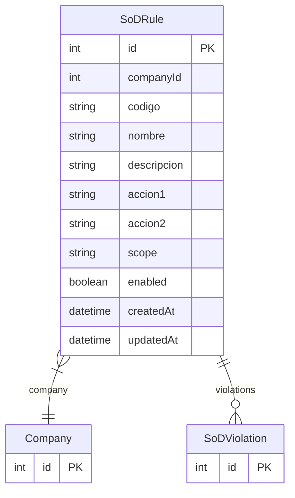

# SoDRule

> Table name: `sod_rules`

**Schema location:** Lines 7176-7194

## Fields

| Field | Type | Required | Unique | Default | Notes |
|-------|------|----------|--------|---------|-------|
| `id` | `Int` | ✅ | 🔑 PK | `autoincrement(` |  |
| `companyId` | `Int` | ✅ |  | `` |  |
| `codigo` | `String` | ✅ |  | `` | DB: VarChar(20). SOD_001, SOD_002, etc |
| `nombre` | `String` | ✅ |  | `` | DB: VarChar(100) |
| `descripcion` | `String?` | ❌ |  | `` |  |
| `accion1` | `String` | ✅ |  | `` | DB: VarChar(50). Acción que el usuario hizo |
| `accion2` | `String` | ✅ |  | `` | DB: VarChar(50). Acción que no puede hacer |
| `scope` | `String` | ✅ |  | `"SAME_DOCUMENT"` | DB: VarChar(30). SAME_DOCUMENT, SAME_SUPPLIER, GLOBAL |
| `enabled` | `Boolean` | ✅ |  | `true` |  |
| `createdAt` | `DateTime` | ✅ |  | `now(` |  |
| `updatedAt` | `DateTime` | ✅ |  | `` |  |

## Relations

| Field | Type | Cardinality | FK Fields | References | On Delete |
|-------|------|-------------|-----------|------------|-----------|
| `company` | [Company](./models/Company.md) | Many-to-One | companyId | id | Cascade |
| `violations` | [SoDViolation](./models/SoDViolation.md) | One-to-Many | - | - | - |

## Referenced By

| Model | Field | Cardinality |
|-------|-------|-------------|
| [Company](./models/Company.md) | `sodRules` | Has many |
| [SoDViolation](./models/SoDViolation.md) | `rule` | Has one |

## Unique Constraints

- `companyId, codigo`

## Entity Diagram

