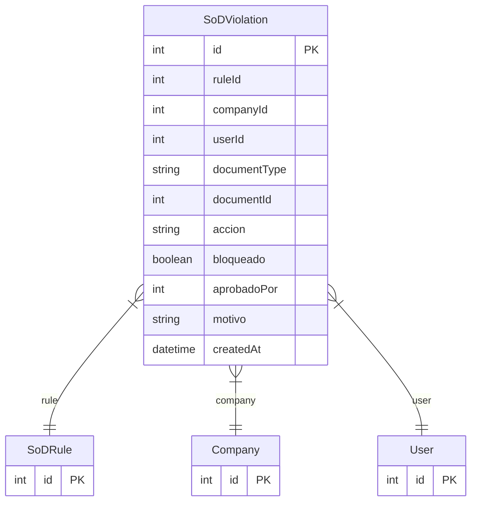

# SoDViolation

> Table name: `sod_violations`

**Schema location:** Lines 7199-7219

## Fields

| Field | Type | Required | Unique | Default | Notes |
|-------|------|----------|--------|---------|-------|
| `id` | `Int` | ✅ | 🔑 PK | `autoincrement(` |  |
| `ruleId` | `Int` | ✅ |  | `` |  |
| `companyId` | `Int` | ✅ |  | `` |  |
| `userId` | `Int` | ✅ |  | `` | Usuario que intentó violar |
| `documentType` | `String` | ✅ |  | `` | DB: VarChar(50). OC, PEDIDO, OP, etc |
| `documentId` | `Int` | ✅ |  | `` |  |
| `accion` | `String` | ✅ |  | `` | DB: VarChar(50) |
| `bloqueado` | `Boolean` | ✅ |  | `true` | Si se bloqueó la acción |
| `aprobadoPor` | `Int?` | ❌ |  | `` | Si alguien con permisos override aprobó |
| `motivo` | `String?` | ❌ |  | `` | Justificación si se aprobó override |
| `createdAt` | `DateTime` | ✅ |  | `now(` |  |

## Relations

| Field | Type | Cardinality | FK Fields | References | On Delete |
|-------|------|-------------|-----------|------------|-----------|
| `rule` | [SoDRule](./models/SoDRule.md) | Many-to-One | ruleId | id | Cascade |
| `company` | [Company](./models/Company.md) | Many-to-One | companyId | id | Cascade |
| `user` | [User](./models/User.md) | Many-to-One | userId | id | - |

## Referenced By

| Model | Field | Cardinality |
|-------|-------|-------------|
| [Company](./models/Company.md) | `sodViolations` | Has many |
| [User](./models/User.md) | `sodViolations` | Has many |
| [SoDRule](./models/SoDRule.md) | `violations` | Has many |

## Indexes

- `companyId`
- `userId`

## Entity Diagram

