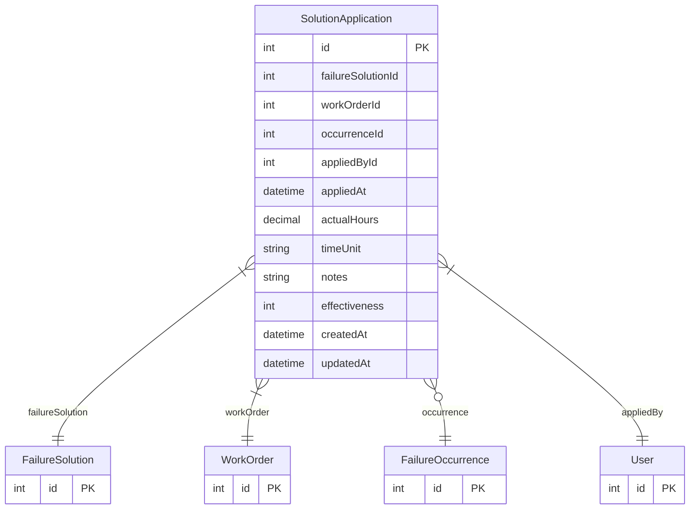

# SolutionApplication

> Table name: `solution_applications`

**Schema location:** Lines 1841-1867

## Fields

| Field | Type | Required | Unique | Default | Notes |
|-------|------|----------|--------|---------|-------|
| `id` | `Int` | ✅ | 🔑 PK | `autoincrement(` |  |
| `failureSolutionId` | `Int` | ✅ |  | `` | Solución que se aplicó |
| `workOrderId` | `Int` | ✅ |  | `` | WorkOrder donde se aplicó |
| `occurrenceId` | `Int?` | ❌ |  | `` | Ocurrencia relacionada (opcional) |
| `appliedById` | `Int` | ✅ |  | `` | Usuario que aplicó la solución |
| `appliedAt` | `DateTime` | ✅ |  | `now(` |  |
| `actualHours` | `Decimal?` | ❌ |  | `` | DB: Decimal(5, 2). Tiempo real de esta aplicación |
| `timeUnit` | `String` | ✅ |  | `"hours"` | DB: VarChar(20). hours, minutes |
| `notes` | `String?` | ❌ |  | `` | Notas específicas de esta aplicación |
| `effectiveness` | `Int?` | ❌ |  | `` | Rating 1-5 de efectividad en esta aplicación |
| `createdAt` | `DateTime` | ✅ |  | `now(` |  |
| `updatedAt` | `DateTime` | ✅ |  | `` |  |

## Relations

| Field | Type | Cardinality | FK Fields | References | On Delete |
|-------|------|-------------|-----------|------------|-----------|
| `failureSolution` | [FailureSolution](./models/FailureSolution.md) | Many-to-One | failureSolutionId | id | Cascade |
| `workOrder` | [WorkOrder](./models/WorkOrder.md) | Many-to-One | workOrderId | id | Cascade |
| `occurrence` | [FailureOccurrence](./models/FailureOccurrence.md) | Many-to-One (optional) | occurrenceId | id | SetNull |
| `appliedBy` | [User](./models/User.md) | Many-to-One | appliedById | id | - |

## Referenced By

| Model | Field | Cardinality |
|-------|-------|-------------|
| [User](./models/User.md) | `solutionApplications` | Has many |
| [WorkOrder](./models/WorkOrder.md) | `solutionApplications` | Has many |
| [FailureOccurrence](./models/FailureOccurrence.md) | `solutionApplications` | Has many |
| [FailureSolution](./models/FailureSolution.md) | `applications` | Has many |

## Indexes

- `failureSolutionId`
- `workOrderId`
- `occurrenceId`
- `appliedById`
- `appliedAt`

## Entity Diagram

