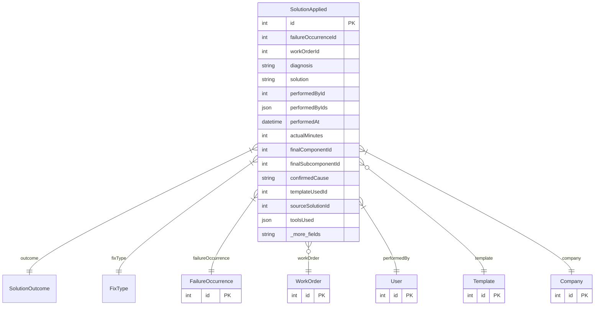

# SolutionApplied

> Table name: `solutions_applied`

**Schema location:** Lines 5714-5779

## Fields

| Field | Type | Required | Unique | Default | Notes |
|-------|------|----------|--------|---------|-------|
| `id` | `Int` | ✅ | 🔑 PK | `autoincrement(` |  |
| `failureOccurrenceId` | `Int` | ✅ |  | `` |  |
| `workOrderId` | `Int?` | ❌ |  | `` | Puede ser null si fue resolución inmediata |
| `diagnosis` | `String` | ✅ |  | `` | DB: Text. "Qué encontré" |
| `solution` | `String` | ✅ |  | `` | DB: Text. "Qué hice" (rich text) |
| `performedById` | `Int` | ✅ |  | `` | Quién y cuándo (OBLIGATORIO) |
| `performedByIds` | `Json?` | ❌ |  | `` | Array de IDs si fueron múltiples técnicos |
| `performedAt` | `DateTime` | ✅ |  | `now(` |  |
| `actualMinutes` | `Int?` | ❌ |  | `` |  |
| `finalComponentId` | `Int?` | ❌ |  | `` | Componente donde realmente estaba la falla |
| `finalSubcomponentId` | `Int?` | ❌ |  | `` | Subcomponente específico |
| `confirmedCause` | `String?` | ❌ |  | `` | DB: VarChar(255) |
| `templateUsedId` | `Int?` | ❌ |  | `` | Plantilla usada (si aplica) |
| `sourceSolutionId` | `Int?` | ❌ |  | `` | Referencia a solución previa (si se prellenó) |
| `toolsUsed` | `Json?` | ❌ |  | `` | [{id, name, quantity}] |
| `sparePartsUsed` | `Json?` | ❌ |  | `` | [{id, name, quantity}] |
| `effectiveness` | `Int?` | ❌ |  | `` | 1-5 |
| `attachments` | `Json?` | ❌ |  | `` | URLs de fotos/archivos |
| `notes` | `String?` | ❌ |  | `` | DB: Text |
| `isObsolete` | `Boolean` | ✅ |  | `false` | Si la solución ya no es válida |
| `obsoleteReason` | `String?` | ❌ |  | `` | DB: VarChar(500). Por qué ya no aplica |
| `obsoleteAt` | `DateTime?` | ❌ |  | `` | Cuándo se marcó como obsoleta |
| `obsoleteById` | `Int?` | ❌ |  | `` | Quién la marcó |
| `companyId` | `Int` | ✅ |  | `` | Multi-tenant |
| `createdAt` | `DateTime` | ✅ |  | `now(` |  |
| `updatedAt` | `DateTime` | ✅ |  | `` |  |

## Relations

| Field | Type | Cardinality | FK Fields | References | On Delete |
|-------|------|-------------|-----------|------------|-----------|
| `outcome` | [SolutionOutcome](./models/SolutionOutcome.md) | Many-to-One | - | - | - |
| `fixType` | [FixType](./models/FixType.md) | Many-to-One | - | - | - |
| `failureOccurrence` | [FailureOccurrence](./models/FailureOccurrence.md) | Many-to-One | failureOccurrenceId | id | Cascade |
| `workOrder` | [WorkOrder](./models/WorkOrder.md) | Many-to-One (optional) | workOrderId | id | - |
| `performedBy` | [User](./models/User.md) | Many-to-One | performedById | id | - |
| `template` | [Template](./models/Template.md) | Many-to-One (optional) | templateUsedId | id | - |
| `company` | [Company](./models/Company.md) | Many-to-One | companyId | id | Cascade |

## Referenced By

| Model | Field | Cardinality |
|-------|-------|-------------|
| [Company](./models/Company.md) | `solutionsApplied` | Has many |
| [User](./models/User.md) | `solutionsAppliedPerformed` | Has many |
| [WorkOrder](./models/WorkOrder.md) | `solutionsApplied` | Has many |
| [FailureOccurrence](./models/FailureOccurrence.md) | `solutionsApplied` | Has many |
| [Template](./models/Template.md) | `solutionsApplied` | Has many |

## Indexes

- `failureOccurrenceId`
- `workOrderId`
- `performedById, performedAt`
- `companyId, performedAt`
- `finalSubcomponentId, effectiveness`
- `companyId, finalSubcomponentId, performedAt`
- `companyId, outcome`
- `companyId, outcome, effectiveness`
- `companyId, isObsolete, outcome`

## Entity Diagram

