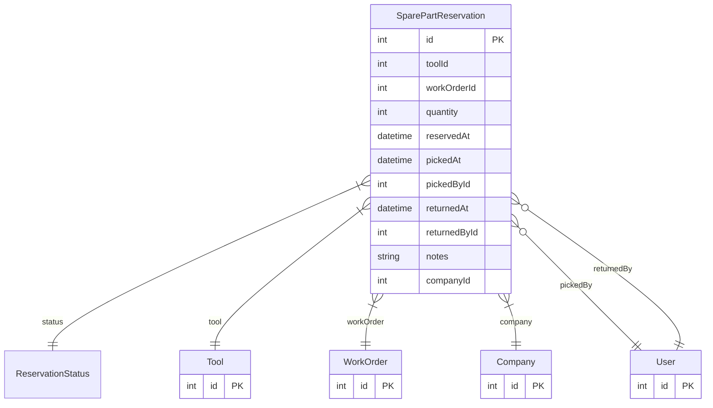

# SparePartReservation

> Table name: `spare_part_reservations`

**Schema location:** Lines 1324-1348

## Fields

| Field | Type | Required | Unique | Default | Notes |
|-------|------|----------|--------|---------|-------|
| `id` | `Int` | ✅ | 🔑 PK | `autoincrement(` |  |
| `toolId` | `Int` | ✅ |  | `` |  |
| `workOrderId` | `Int` | ✅ |  | `` |  |
| `quantity` | `Int` | ✅ |  | `` |  |
| `reservedAt` | `DateTime` | ✅ |  | `now(` |  |
| `pickedAt` | `DateTime?` | ❌ |  | `` |  |
| `pickedById` | `Int?` | ❌ |  | `` |  |
| `returnedAt` | `DateTime?` | ❌ |  | `` |  |
| `returnedById` | `Int?` | ❌ |  | `` |  |
| `notes` | `String?` | ❌ |  | `` |  |
| `companyId` | `Int` | ✅ |  | `` |  |

## Relations

| Field | Type | Cardinality | FK Fields | References | On Delete |
|-------|------|-------------|-----------|------------|-----------|
| `status` | [ReservationStatus](./models/ReservationStatus.md) | Many-to-One | - | - | - |
| `tool` | [Tool](./models/Tool.md) | Many-to-One | toolId | id | Cascade |
| `workOrder` | [WorkOrder](./models/WorkOrder.md) | Many-to-One | workOrderId | id | Cascade |
| `company` | [Company](./models/Company.md) | Many-to-One | companyId | id | Cascade |
| `pickedBy` | [User](./models/User.md) | Many-to-One (optional) | pickedById | id | - |
| `returnedBy` | [User](./models/User.md) | Many-to-One (optional) | returnedById | id | - |

## Referenced By

| Model | Field | Cardinality |
|-------|-------|-------------|
| [Company](./models/Company.md) | `sparePartReservations` | Has many |
| [User](./models/User.md) | `reservationsPickedBy` | Has many |
| [User](./models/User.md) | `reservationsReturnedBy` | Has many |
| [Tool](./models/Tool.md) | `reservations` | Has many |
| [WorkOrder](./models/WorkOrder.md) | `sparePartReservations` | Has many |

## Indexes

- `workOrderId`
- `toolId`
- `companyId, status`

## Entity Diagram

