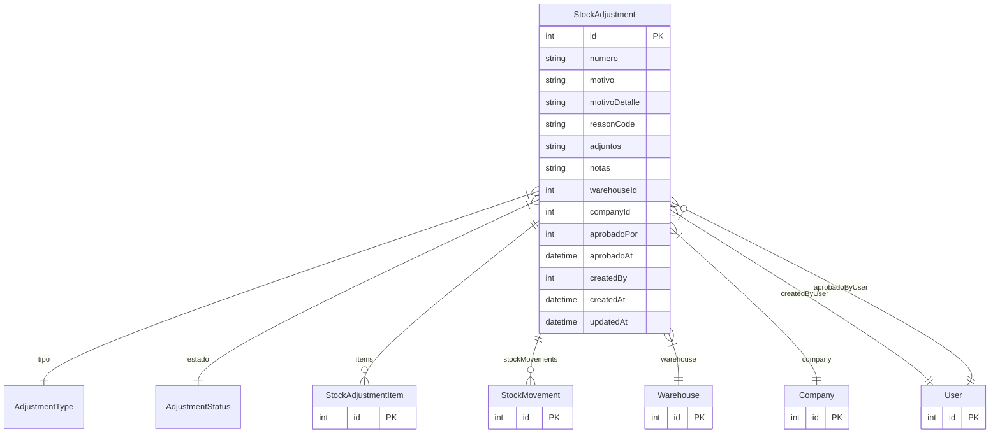

# StockAdjustment

> Table name: `stock_adjustments`

**Schema location:** Lines 6318-6347

## Fields

| Field | Type | Required | Unique | Default | Notes |
|-------|------|----------|--------|---------|-------|
| `id` | `Int` | ✅ | 🔑 PK | `autoincrement(` |  |
| `numero` | `String` | ✅ |  | `` | DB: VarChar(50) |
| `motivo` | `String` | ✅ |  | `` |  |
| `motivoDetalle` | `String?` | ❌ |  | `` | Descripción libre adicional |
| `reasonCode` | `String?` | ❌ |  | `` | DB: VarChar(50). Código predefinido según tipo |
| `adjuntos` | `String[]` | ✅ |  | `` | URLs a S3 (fotos/PDFs evidencia) |
| `notas` | `String?` | ❌ |  | `` |  |
| `warehouseId` | `Int` | ✅ |  | `` |  |
| `companyId` | `Int` | ✅ |  | `` |  |
| `aprobadoPor` | `Int?` | ❌ |  | `` |  |
| `aprobadoAt` | `DateTime?` | ❌ |  | `` |  |
| `createdBy` | `Int` | ✅ |  | `` |  |
| `createdAt` | `DateTime` | ✅ |  | `now(` |  |
| `updatedAt` | `DateTime` | ✅ |  | `` |  |

## Relations

| Field | Type | Cardinality | FK Fields | References | On Delete |
|-------|------|-------------|-----------|------------|-----------|
| `tipo` | [AdjustmentType](./models/AdjustmentType.md) | Many-to-One | - | - | - |
| `estado` | [AdjustmentStatus](./models/AdjustmentStatus.md) | Many-to-One | - | - | - |
| `items` | [StockAdjustmentItem](./models/StockAdjustmentItem.md) | One-to-Many | - | - | - |
| `stockMovements` | [StockMovement](./models/StockMovement.md) | One-to-Many | - | - | - |
| `warehouse` | [Warehouse](./models/Warehouse.md) | Many-to-One | warehouseId | id | - |
| `company` | [Company](./models/Company.md) | Many-to-One | companyId | id | Cascade |
| `createdByUser` | [User](./models/User.md) | Many-to-One | createdBy | id | - |
| `aprobadoByUser` | [User](./models/User.md) | Many-to-One (optional) | aprobadoPor | id | - |

## Referenced By

| Model | Field | Cardinality |
|-------|-------|-------------|
| [Company](./models/Company.md) | `stockAdjustments` | Has many |
| [User](./models/User.md) | `stockAdjustmentsCreated` | Has many |
| [User](./models/User.md) | `stockAdjustmentsApproved` | Has many |
| [Warehouse](./models/Warehouse.md) | `stockAdjustments` | Has many |
| [StockMovement](./models/StockMovement.md) | `adjustment` | Has one |
| [StockAdjustmentItem](./models/StockAdjustmentItem.md) | `adjustment` | Has one |

## Indexes

- `companyId`
- `warehouseId`
- `estado`

## Entity Diagram

