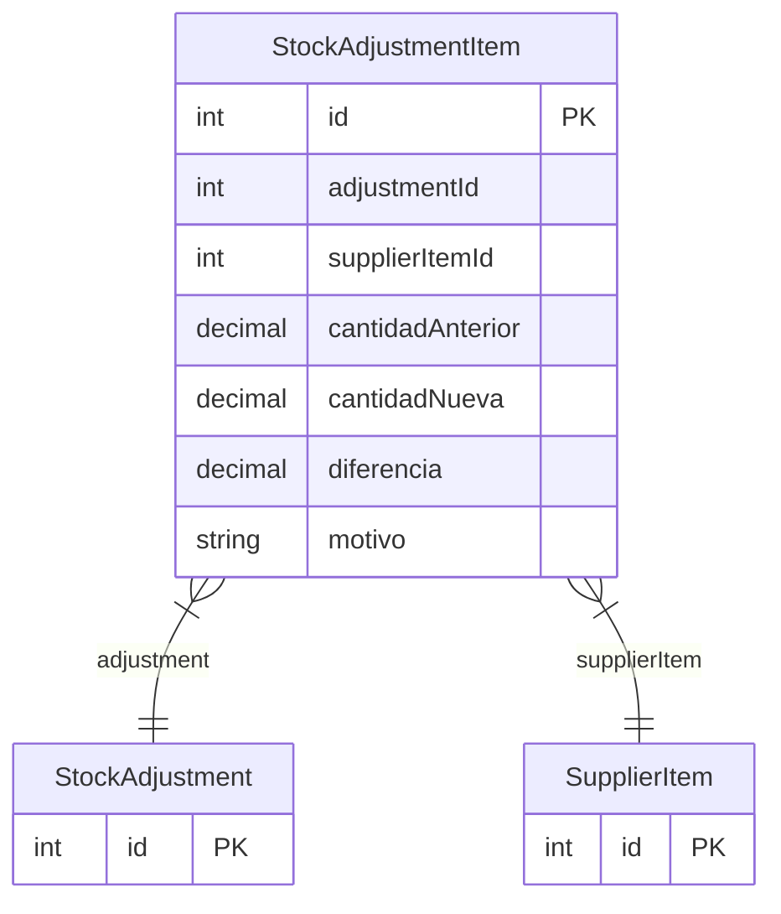

# StockAdjustmentItem

> Table name: `stock_adjustment_items`

**Schema location:** Lines 6349-6363

## Fields

| Field | Type | Required | Unique | Default | Notes |
|-------|------|----------|--------|---------|-------|
| `id` | `Int` | ✅ | 🔑 PK | `autoincrement(` |  |
| `adjustmentId` | `Int` | ✅ |  | `` |  |
| `supplierItemId` | `Int` | ✅ |  | `` |  |
| `cantidadAnterior` | `Decimal` | ✅ |  | `` | DB: Decimal(15, 4) |
| `cantidadNueva` | `Decimal` | ✅ |  | `` | DB: Decimal(15, 4) |
| `diferencia` | `Decimal` | ✅ |  | `` | DB: Decimal(15, 4) |
| `motivo` | `String?` | ❌ |  | `` |  |

## Relations

| Field | Type | Cardinality | FK Fields | References | On Delete |
|-------|------|-------------|-----------|------------|-----------|
| `adjustment` | [StockAdjustment](./models/StockAdjustment.md) | Many-to-One | adjustmentId | id | Cascade |
| `supplierItem` | [SupplierItem](./models/SupplierItem.md) | Many-to-One | supplierItemId | id | - |

## Referenced By

| Model | Field | Cardinality |
|-------|-------|-------------|
| [SupplierItem](./models/SupplierItem.md) | `stockAdjustmentItems` | Has many |
| [StockAdjustment](./models/StockAdjustment.md) | `items` | Has many |

## Indexes

- `adjustmentId`

## Entity Diagram

