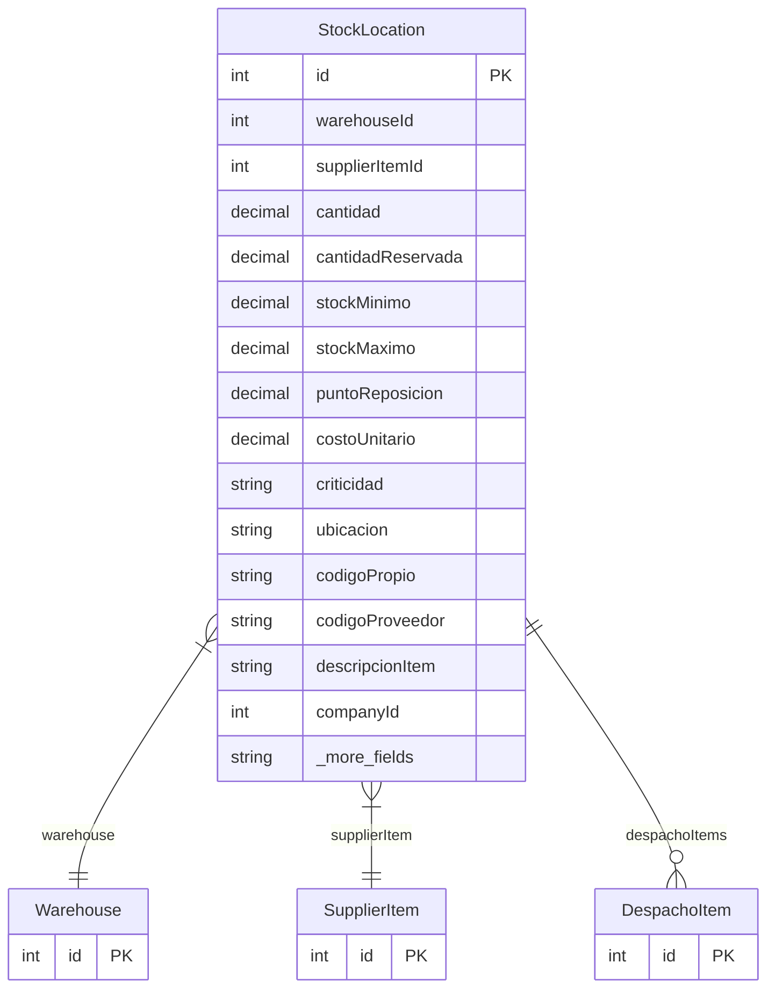

# StockLocation

> Table name: `stock_locations`

**Schema location:** Lines 6145-6178

## Fields

| Field | Type | Required | Unique | Default | Notes |
|-------|------|----------|--------|---------|-------|
| `id` | `Int` | ✅ | 🔑 PK | `autoincrement(` |  |
| `warehouseId` | `Int` | ✅ |  | `` |  |
| `supplierItemId` | `Int` | ✅ |  | `` |  |
| `cantidad` | `Decimal` | ✅ |  | `` | DB: Decimal(15, 4) |
| `cantidadReservada` | `Decimal` | ✅ |  | `0` | DB: Decimal(15, 4) |
| `stockMinimo` | `Decimal?` | ❌ |  | `` | DB: Decimal(15, 4) |
| `stockMaximo` | `Decimal?` | ❌ |  | `` | DB: Decimal(15, 4) |
| `puntoReposicion` | `Decimal?` | ❌ |  | `` | DB: Decimal(15, 4). Si diferente de stockMinimo |
| `costoUnitario` | `Decimal?` | ❌ |  | `` | DB: Decimal(15, 4). Último costo de entrada |
| `criticidad` | `String?` | ❌ |  | `` | DB: VarChar(10). A, B, C, CRITICO |
| `ubicacion` | `String?` | ❌ |  | `` | DB: VarChar(100). Ubicación física dentro del depósito |
| `codigoPropio` | `String?` | ❌ |  | `` | DB: VarChar(100). Código interno usado en última entrada |
| `codigoProveedor` | `String?` | ❌ |  | `` | DB: VarChar(100). Código del proveedor usado en última entrada |
| `descripcionItem` | `String?` | ❌ |  | `` | DB: VarChar(255). Descripción del item en última entrada |
| `companyId` | `Int` | ✅ |  | `` |  |
| `updatedAt` | `DateTime` | ✅ |  | `` |  |
| `ubicacionFisica` | `String?` | ❌ |  | `` | DB: VarChar(100). Rack-A-01, Bin-B-03 |
| `metodoSalida` | `String?` | ❌ |  | `` | DB: VarChar(20). FIFO, FEFO, LIFO, MANUAL |

## Relations

| Field | Type | Cardinality | FK Fields | References | On Delete |
|-------|------|-------------|-----------|------------|-----------|
| `warehouse` | [Warehouse](./models/Warehouse.md) | Many-to-One | warehouseId | id | Cascade |
| `supplierItem` | [SupplierItem](./models/SupplierItem.md) | Many-to-One | supplierItemId | id | Cascade |
| `despachoItems` | [DespachoItem](./models/DespachoItem.md) | One-to-Many | - | - | - |

## Referenced By

| Model | Field | Cardinality |
|-------|-------|-------------|
| [SupplierItem](./models/SupplierItem.md) | `stockLocations` | Has many |
| [Warehouse](./models/Warehouse.md) | `stockLocations` | Has many |
| [DespachoItem](./models/DespachoItem.md) | `stockLocation` | Has one |

## Indexes

- `companyId`
- `warehouseId`
- `supplierItemId`

## Unique Constraints

- `warehouseId, supplierItemId`

## Entity Diagram

