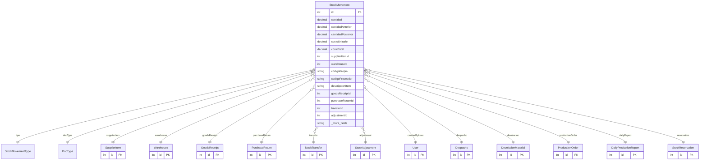

# StockMovement

> Table name: `stock_movements`

**Schema location:** Lines 6181-6248

## Fields

| Field | Type | Required | Unique | Default | Notes |
|-------|------|----------|--------|---------|-------|
| `id` | `Int` | ✅ | 🔑 PK | `autoincrement(` |  |
| `cantidad` | `Decimal` | ✅ |  | `` | DB: Decimal(15, 4) |
| `cantidadAnterior` | `Decimal` | ✅ |  | `` | DB: Decimal(15, 4) |
| `cantidadPosterior` | `Decimal` | ✅ |  | `` | DB: Decimal(15, 4) |
| `costoUnitario` | `Decimal?` | ❌ |  | `` | DB: Decimal(15, 2) |
| `costoTotal` | `Decimal?` | ❌ |  | `` | DB: Decimal(15, 2) |
| `supplierItemId` | `Int` | ✅ |  | `` |  |
| `warehouseId` | `Int` | ✅ |  | `` |  |
| `codigoPropio` | `String?` | ❌ |  | `` | DB: VarChar(100). Código interno usado en OC/Recepción |
| `codigoProveedor` | `String?` | ❌ |  | `` | DB: VarChar(100). Código del proveedor usado en OC/Recepción |
| `descripcionItem` | `String?` | ❌ |  | `` | DB: VarChar(255). Descripción del item al momento del movimiento |
| `goodsReceiptId` | `Int?` | ❌ |  | `` | Referencias opcionales según el tipo de movimiento |
| `purchaseReturnId` | `Int?` | ❌ |  | `` |  |
| `transferId` | `Int?` | ❌ |  | `` |  |
| `adjustmentId` | `Int?` | ❌ |  | `` |  |
| `despachoId` | `Int?` | ❌ |  | `` | Módulo Almacén - nuevas referencias |
| `devolucionId` | `Int?` | ❌ |  | `` |  |
| `productionOrderId` | `Int?` | ❌ |  | `` |  |
| `dailyProductionReportId` | `Int?` | ❌ |  | `` |  |
| `reservationId` | `Int?` | ❌ |  | `` |  |
| `sourceNumber` | `String?` | ❌ |  | `` | DB: VarChar(50). "REC-2026-00001", "AJU-2026-00003", etc. |
| `motivo` | `String?` | ❌ |  | `` |  |
| `notas` | `String?` | ❌ |  | `` |  |
| `companyId` | `Int` | ✅ |  | `` |  |
| `createdBy` | `Int` | ✅ |  | `` |  |
| `createdAt` | `DateTime` | ✅ |  | `now(` |  |

## Relations

| Field | Type | Cardinality | FK Fields | References | On Delete |
|-------|------|-------------|-----------|------------|-----------|
| `tipo` | [StockMovementType](./models/StockMovementType.md) | Many-to-One | - | - | - |
| `docType` | [DocType](./models/DocType.md) | Many-to-One | - | - | - |
| `supplierItem` | [SupplierItem](./models/SupplierItem.md) | Many-to-One | supplierItemId | id | - |
| `warehouse` | [Warehouse](./models/Warehouse.md) | Many-to-One | warehouseId | id | - |
| `goodsReceipt` | [GoodsReceipt](./models/GoodsReceipt.md) | Many-to-One (optional) | goodsReceiptId | id | - |
| `purchaseReturn` | [PurchaseReturn](./models/PurchaseReturn.md) | Many-to-One (optional) | purchaseReturnId | id | - |
| `transfer` | [StockTransfer](./models/StockTransfer.md) | Many-to-One (optional) | transferId | id | - |
| `adjustment` | [StockAdjustment](./models/StockAdjustment.md) | Many-to-One (optional) | adjustmentId | id | - |
| `createdByUser` | [User](./models/User.md) | Many-to-One | createdBy | id | - |
| `despacho` | [Despacho](./models/Despacho.md) | Many-to-One (optional) | despachoId | id | - |
| `devolucion` | [DevolucionMaterial](./models/DevolucionMaterial.md) | Many-to-One (optional) | devolucionId | id | - |
| `productionOrder` | [ProductionOrder](./models/ProductionOrder.md) | Many-to-One (optional) | productionOrderId | id | - |
| `dailyReport` | [DailyProductionReport](./models/DailyProductionReport.md) | Many-to-One (optional) | dailyProductionReportId | id | - |
| `reservation` | [StockReservation](./models/StockReservation.md) | Many-to-One (optional) | reservationId | id | - |

## Referenced By

| Model | Field | Cardinality |
|-------|-------|-------------|
| [User](./models/User.md) | `stockMovementsCreated` | Has many |
| [SupplierItem](./models/SupplierItem.md) | `stockMovements` | Has many |
| [Warehouse](./models/Warehouse.md) | `stockMovements` | Has many |
| [StockTransfer](./models/StockTransfer.md) | `stockMovements` | Has many |
| [StockAdjustment](./models/StockAdjustment.md) | `stockMovements` | Has many |
| [GoodsReceipt](./models/GoodsReceipt.md) | `stockMovements` | Has many |
| [PurchaseReturn](./models/PurchaseReturn.md) | `stockMovements` | Has many |
| [ProductionOrder](./models/ProductionOrder.md) | `stockMovements` | Has many |
| [DailyProductionReport](./models/DailyProductionReport.md) | `stockMovements` | Has many |
| [StockReservation](./models/StockReservation.md) | `stockMovements` | Has many |
| [Despacho](./models/Despacho.md) | `stockMovements` | Has many |
| [DevolucionMaterial](./models/DevolucionMaterial.md) | `stockMovements` | Has many |

## Indexes

- `supplierItemId`
- `warehouseId`
- `companyId`
- `createdAt`
- `tipo`
- `docType`
- `companyId, docType`
- `purchaseReturnId`
- `despachoId`
- `devolucionId`
- `productionOrderId`
- `dailyProductionReportId`
- `reservationId`
- `supplierItemId, warehouseId, createdAt`

## Unique Constraints

- `purchaseReturnId, supplierItemId`

## Entity Diagram

