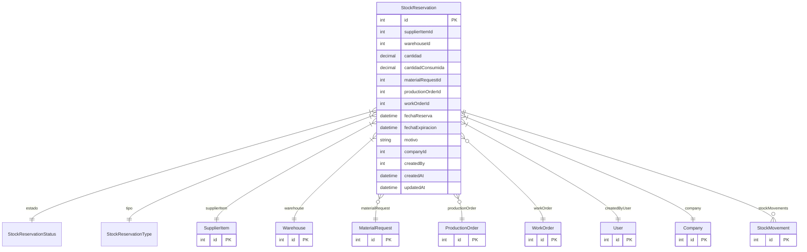

# StockReservation

> Table name: `stock_reservations`

**Schema location:** Lines 14538-14577

## Fields

| Field | Type | Required | Unique | Default | Notes |
|-------|------|----------|--------|---------|-------|
| `id` | `Int` | ✅ | 🔑 PK | `autoincrement(` |  |
| `supplierItemId` | `Int` | ✅ |  | `` |  |
| `warehouseId` | `Int` | ✅ |  | `` |  |
| `cantidad` | `Decimal` | ✅ |  | `` | DB: Decimal(15, 4) |
| `cantidadConsumida` | `Decimal` | ✅ |  | `0` | DB: Decimal(15, 4) |
| `materialRequestId` | `Int?` | ❌ |  | `` |  |
| `productionOrderId` | `Int?` | ❌ |  | `` |  |
| `workOrderId` | `Int?` | ❌ |  | `` |  |
| `fechaReserva` | `DateTime` | ✅ |  | `now(` |  |
| `fechaExpiracion` | `DateTime?` | ❌ |  | `` | Auto-liberar si no se usa |
| `motivo` | `String?` | ❌ |  | `` |  |
| `companyId` | `Int` | ✅ |  | `` |  |
| `createdBy` | `Int` | ✅ |  | `` |  |
| `createdAt` | `DateTime` | ✅ |  | `now(` |  |
| `updatedAt` | `DateTime` | ✅ |  | `` |  |

## Relations

| Field | Type | Cardinality | FK Fields | References | On Delete |
|-------|------|-------------|-----------|------------|-----------|
| `estado` | [StockReservationStatus](./models/StockReservationStatus.md) | Many-to-One | - | - | - |
| `tipo` | [StockReservationType](./models/StockReservationType.md) | Many-to-One | - | - | - |
| `supplierItem` | [SupplierItem](./models/SupplierItem.md) | Many-to-One | supplierItemId | id | - |
| `warehouse` | [Warehouse](./models/Warehouse.md) | Many-to-One | warehouseId | id | - |
| `materialRequest` | [MaterialRequest](./models/MaterialRequest.md) | Many-to-One (optional) | materialRequestId | id | - |
| `productionOrder` | [ProductionOrder](./models/ProductionOrder.md) | Many-to-One (optional) | productionOrderId | id | - |
| `workOrder` | [WorkOrder](./models/WorkOrder.md) | Many-to-One (optional) | workOrderId | id | - |
| `createdByUser` | [User](./models/User.md) | Many-to-One | createdBy | id | - |
| `company` | [Company](./models/Company.md) | Many-to-One | companyId | id | Cascade |
| `stockMovements` | [StockMovement](./models/StockMovement.md) | One-to-Many | - | - | - |

## Referenced By

| Model | Field | Cardinality |
|-------|-------|-------------|
| [Company](./models/Company.md) | `stockReservations` | Has many |
| [User](./models/User.md) | `stockReservationsCreated` | Has many |
| [WorkOrder](./models/WorkOrder.md) | `stockReservations` | Has many |
| [SupplierItem](./models/SupplierItem.md) | `stockReservations` | Has many |
| [Warehouse](./models/Warehouse.md) | `stockReservations` | Has many |
| [StockMovement](./models/StockMovement.md) | `reservation` | Has one |
| [ProductionOrder](./models/ProductionOrder.md) | `stockReservations` | Has many |
| [MaterialRequest](./models/MaterialRequest.md) | `reservations` | Has many |

## Indexes

- `supplierItemId, warehouseId`
- `estado`
- `companyId`
- `materialRequestId`
- `productionOrderId`
- `workOrderId`

## Entity Diagram

