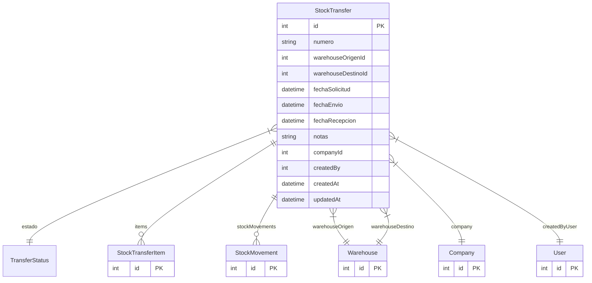

# StockTransfer

> Table name: `stock_transfers`

**Schema location:** Lines 6265-6290

## Fields

| Field | Type | Required | Unique | Default | Notes |
|-------|------|----------|--------|---------|-------|
| `id` | `Int` | ✅ | 🔑 PK | `autoincrement(` |  |
| `numero` | `String` | ✅ |  | `` | DB: VarChar(50) |
| `warehouseOrigenId` | `Int` | ✅ |  | `` |  |
| `warehouseDestinoId` | `Int` | ✅ |  | `` |  |
| `fechaSolicitud` | `DateTime` | ✅ |  | `` | DB: Date |
| `fechaEnvio` | `DateTime?` | ❌ |  | `` | DB: Date |
| `fechaRecepcion` | `DateTime?` | ❌ |  | `` | DB: Date |
| `notas` | `String?` | ❌ |  | `` |  |
| `companyId` | `Int` | ✅ |  | `` |  |
| `createdBy` | `Int` | ✅ |  | `` |  |
| `createdAt` | `DateTime` | ✅ |  | `now(` |  |
| `updatedAt` | `DateTime` | ✅ |  | `` |  |

## Relations

| Field | Type | Cardinality | FK Fields | References | On Delete |
|-------|------|-------------|-----------|------------|-----------|
| `estado` | [TransferStatus](./models/TransferStatus.md) | Many-to-One | - | - | - |
| `items` | [StockTransferItem](./models/StockTransferItem.md) | One-to-Many | - | - | - |
| `stockMovements` | [StockMovement](./models/StockMovement.md) | One-to-Many | - | - | - |
| `warehouseOrigen` | [Warehouse](./models/Warehouse.md) | Many-to-One | warehouseOrigenId | id | - |
| `warehouseDestino` | [Warehouse](./models/Warehouse.md) | Many-to-One | warehouseDestinoId | id | - |
| `company` | [Company](./models/Company.md) | Many-to-One | companyId | id | Cascade |
| `createdByUser` | [User](./models/User.md) | Many-to-One | createdBy | id | - |

## Referenced By

| Model | Field | Cardinality |
|-------|-------|-------------|
| [Company](./models/Company.md) | `stockTransfers` | Has many |
| [User](./models/User.md) | `stockTransfersCreated` | Has many |
| [Warehouse](./models/Warehouse.md) | `transfersOrigen` | Has many |
| [Warehouse](./models/Warehouse.md) | `transfersDestino` | Has many |
| [StockMovement](./models/StockMovement.md) | `transfer` | Has one |
| [StockTransferItem](./models/StockTransferItem.md) | `transfer` | Has one |

## Indexes

- `companyId`
- `estado`

## Entity Diagram

