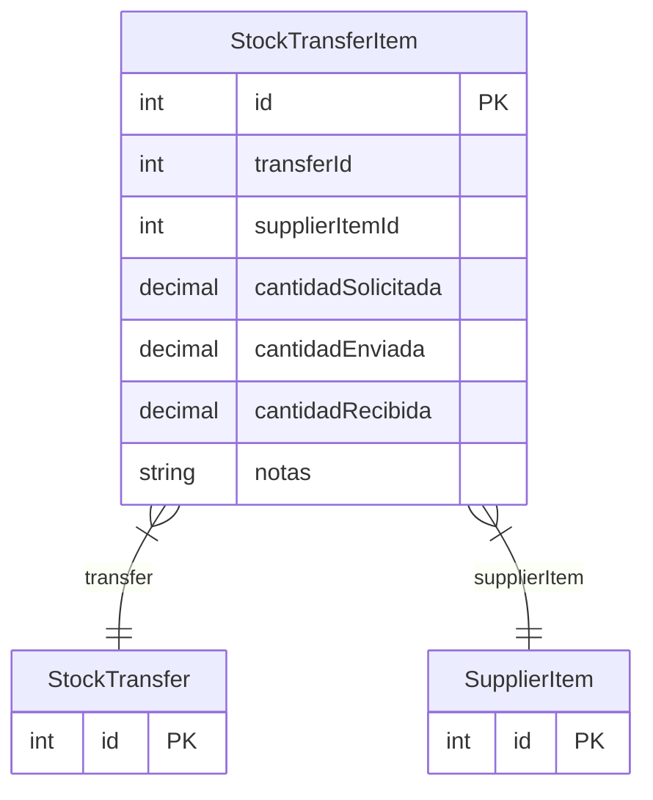

# StockTransferItem

> Table name: `stock_transfer_items`

**Schema location:** Lines 6292-6306

## Fields

| Field | Type | Required | Unique | Default | Notes |
|-------|------|----------|--------|---------|-------|
| `id` | `Int` | ✅ | 🔑 PK | `autoincrement(` |  |
| `transferId` | `Int` | ✅ |  | `` |  |
| `supplierItemId` | `Int` | ✅ |  | `` |  |
| `cantidadSolicitada` | `Decimal` | ✅ |  | `` | DB: Decimal(15, 4) |
| `cantidadEnviada` | `Decimal?` | ❌ |  | `` | DB: Decimal(15, 4) |
| `cantidadRecibida` | `Decimal?` | ❌ |  | `` | DB: Decimal(15, 4) |
| `notas` | `String?` | ❌ |  | `` |  |

## Relations

| Field | Type | Cardinality | FK Fields | References | On Delete |
|-------|------|-------------|-----------|------------|-----------|
| `transfer` | [StockTransfer](./models/StockTransfer.md) | Many-to-One | transferId | id | Cascade |
| `supplierItem` | [SupplierItem](./models/SupplierItem.md) | Many-to-One | supplierItemId | id | - |

## Referenced By

| Model | Field | Cardinality |
|-------|-------|-------------|
| [SupplierItem](./models/SupplierItem.md) | `stockTransferItems` | Has many |
| [StockTransfer](./models/StockTransfer.md) | `items` | Has many |

## Indexes

- `transferId`

## Entity Diagram

