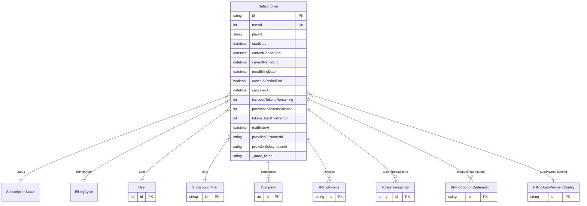

# Subscription

> Table name: `subscriptions`

**Schema location:** Lines 11294-11344

## Fields

| Field | Type | Required | Unique | Default | Notes |
|-------|------|----------|--------|---------|-------|
| `id` | `String` | ✅ | 🔑 PK | `` |  |
| `userId` | `Int` | ✅ | ✅ | `` |  |
| `planId` | `String` | ✅ |  | `` |  |
| `startDate` | `DateTime` | ✅ |  | `now(` | Fechas |
| `currentPeriodStart` | `DateTime` | ✅ |  | `` |  |
| `currentPeriodEnd` | `DateTime` | ✅ |  | `` |  |
| `nextBillingDate` | `DateTime` | ✅ |  | `` |  |
| `cancelAtPeriodEnd` | `Boolean` | ✅ |  | `false` | Cancelación |
| `canceledAt` | `DateTime?` | ❌ |  | `` |  |
| `includedTokensRemaining` | `Int` | ✅ |  | `0` | Allowance del período (resetea) |
| `purchasedTokensBalance` | `Int` | ✅ |  | `0` | Comprados (carry-over) |
| `tokensUsedThisPeriod` | `Int` | ✅ |  | `0` |  |
| `trialEndsAt` | `DateTime?` | ❌ |  | `` | Trial |
| `providerCustomerId` | `String?` | ❌ |  | `` | Provider (para futuro Stripe/MP) |
| `providerSubscriptionId` | `String?` | ❌ |  | `` |  |
| `createdAt` | `DateTime` | ✅ |  | `now(` | Timestamps |
| `updatedAt` | `DateTime` | ✅ |  | `` |  |

## Relations

| Field | Type | Cardinality | FK Fields | References | On Delete |
|-------|------|-------------|-----------|------------|-----------|
| `status` | [SubscriptionStatus](./models/SubscriptionStatus.md) | Many-to-One | - | - | - |
| `billingCycle` | [BillingCycle](./models/BillingCycle.md) | Many-to-One | - | - | - |
| `user` | [User](./models/User.md) | Many-to-One | userId | id | Cascade |
| `plan` | [SubscriptionPlan](./models/SubscriptionPlan.md) | Many-to-One | planId | id | - |
| `companies` | [Company](./models/Company.md) | One-to-Many | - | - | - |
| `invoices` | [BillingInvoice](./models/BillingInvoice.md) | One-to-Many | - | - | - |
| `tokenTransactions` | [TokenTransaction](./models/TokenTransaction.md) | One-to-Many | - | - | - |
| `couponRedemptions` | [BillingCouponRedemption](./models/BillingCouponRedemption.md) | One-to-Many | - | - | - |
| `autoPaymentConfig` | [BillingAutoPaymentConfig](./models/BillingAutoPaymentConfig.md) | Many-to-One (optional) | - | - | - |

## Referenced By

| Model | Field | Cardinality |
|-------|-------|-------------|
| [Company](./models/Company.md) | `subscription` | Has one |
| [User](./models/User.md) | `subscription` | Has one |
| [SubscriptionPlan](./models/SubscriptionPlan.md) | `subscriptions` | Has many |
| [BillingInvoice](./models/BillingInvoice.md) | `subscription` | Has one |
| [TokenTransaction](./models/TokenTransaction.md) | `subscription` | Has one |
| [BillingCouponRedemption](./models/BillingCouponRedemption.md) | `subscription` | Has one |
| [BillingAutoPaymentConfig](./models/BillingAutoPaymentConfig.md) | `subscription` | Has one |

## Indexes

- `status`
- `nextBillingDate`
- `planId`

## Entity Diagram

