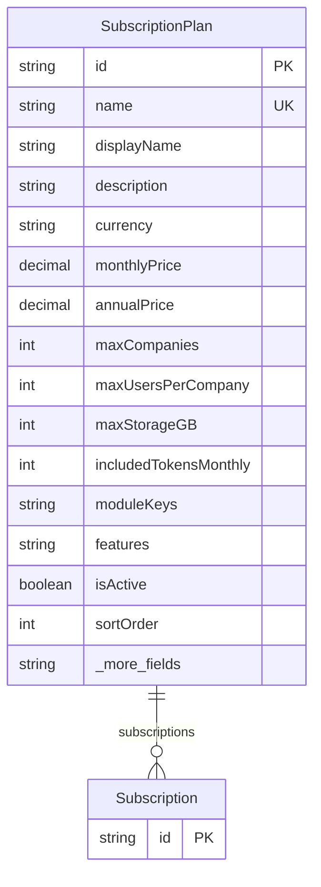

# SubscriptionPlan

> Table name: `subscription_plans`

**Schema location:** Lines 11256-11291

## Fields

| Field | Type | Required | Unique | Default | Notes |
|-------|------|----------|--------|---------|-------|
| `id` | `String` | ✅ | 🔑 PK | `` |  |
| `name` | `String` | ✅ | ✅ | `` |  |
| `displayName` | `String` | ✅ |  | `` |  |
| `description` | `String?` | ❌ |  | `` |  |
| `currency` | `String` | ✅ |  | `"ARS"` | Precios con moneda |
| `monthlyPrice` | `Decimal` | ✅ |  | `` | DB: Decimal(12, 2) |
| `annualPrice` | `Decimal?` | ❌ |  | `` | DB: Decimal(12, 2) |
| `maxCompanies` | `Int?` | ❌ |  | `` | Límites (NULL = ilimitado) |
| `maxUsersPerCompany` | `Int?` | ❌ |  | `` |  |
| `maxStorageGB` | `Int?` | ❌ |  | `` |  |
| `includedTokensMonthly` | `Int` | ✅ |  | `0` |  |
| `moduleKeys` | `String[]` | ✅ |  | `[]` | Módulos permitidos (entitlement) |
| `features` | `String[]` | ✅ |  | `[]` |  |
| `isActive` | `Boolean` | ✅ |  | `true` | Estado y orden |
| `sortOrder` | `Int` | ✅ |  | `0` |  |
| `color` | `String` | ✅ |  | `"#8B5CF6"` |  |
| `icon` | `String?` | ❌ |  | `` |  |
| `createdAt` | `DateTime` | ✅ |  | `now(` | Timestamps |
| `updatedAt` | `DateTime` | ✅ |  | `` |  |

## Relations

| Field | Type | Cardinality | FK Fields | References | On Delete |
|-------|------|-------------|-----------|------------|-----------|
| `subscriptions` | [Subscription](./models/Subscription.md) | One-to-Many | - | - | - |

## Referenced By

| Model | Field | Cardinality |
|-------|-------|-------------|
| [Subscription](./models/Subscription.md) | `plan` | Has one |

## Entity Diagram

