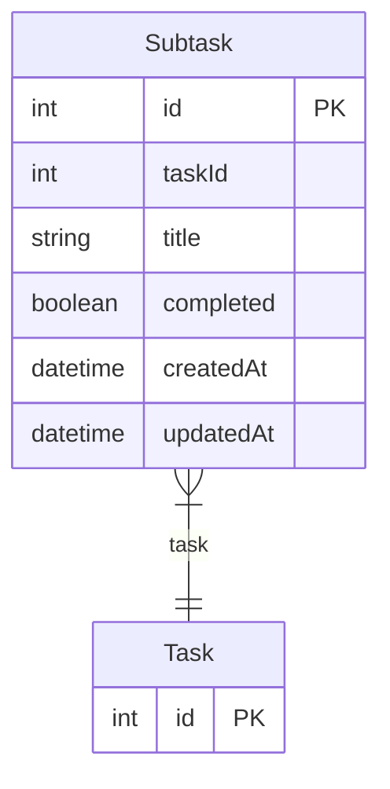

# Subtask

> Table name: `Subtask`

**Schema location:** Lines 1939-1949

## Fields

| Field | Type | Required | Unique | Default | Notes |
|-------|------|----------|--------|---------|-------|
| `id` | `Int` | ✅ | 🔑 PK | `autoincrement(` |  |
| `taskId` | `Int` | ✅ |  | `` |  |
| `title` | `String` | ✅ |  | `` |  |
| `completed` | `Boolean` | ✅ |  | `false` |  |
| `createdAt` | `DateTime` | ✅ |  | `now(` |  |
| `updatedAt` | `DateTime` | ✅ |  | `` |  |

## Relations

| Field | Type | Cardinality | FK Fields | References | On Delete |
|-------|------|-------------|-----------|------------|-----------|
| `task` | [Task](./models/Task.md) | Many-to-One | taskId | id | Cascade |

## Referenced By

| Model | Field | Cardinality |
|-------|-------|-------------|
| [Task](./models/Task.md) | `subtasks` | Has many |

## Entity Diagram

