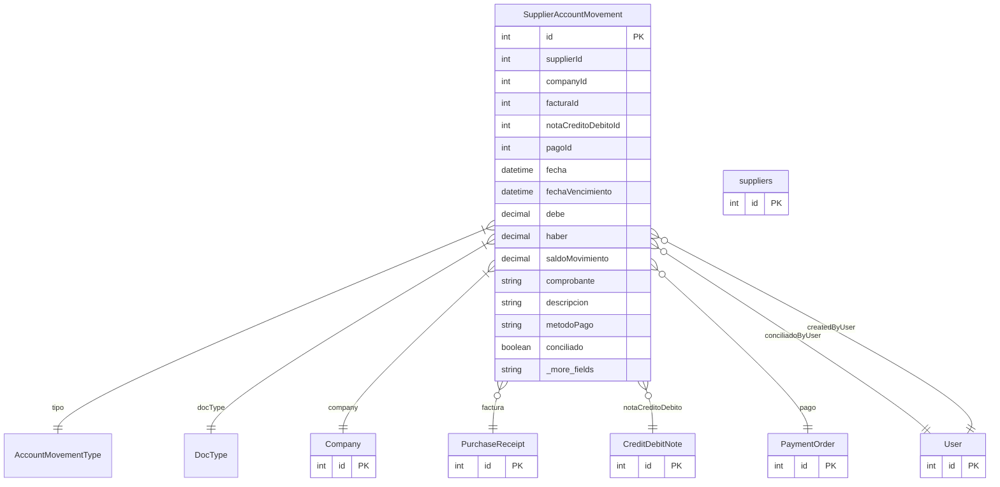

# SupplierAccountMovement

> Table name: `SupplierAccountMovement`

**Schema location:** Lines 3699-3759

## Fields

| Field | Type | Required | Unique | Default | Notes |
|-------|------|----------|--------|---------|-------|
| `id` | `Int` | ✅ | 🔑 PK | `autoincrement(` |  |
| `supplierId` | `Int` | ✅ |  | `` |  |
| `companyId` | `Int` | ✅ |  | `` |  |
| `facturaId` | `Int?` | ❌ |  | `` | Referencias opcionales según el tipo |
| `notaCreditoDebitoId` | `Int?` | ❌ |  | `` |  |
| `pagoId` | `Int?` | ❌ |  | `` |  |
| `fecha` | `DateTime` | ✅ |  | `` | DB: Date. Fechas |
| `fechaVencimiento` | `DateTime?` | ❌ |  | `` | DB: Date |
| `debe` | `Decimal` | ✅ |  | `0` | DB: Decimal(15, 2). Montos |
| `haber` | `Decimal` | ✅ |  | `0` | DB: Decimal(15, 2) |
| `saldoMovimiento` | `Decimal` | ✅ |  | `0` | DB: Decimal(15, 2) |
| `comprobante` | `String?` | ❌ |  | `` | DB: VarChar(100). Información del comprobante |
| `descripcion` | `String?` | ❌ |  | `` |  |
| `metodoPago` | `String?` | ❌ |  | `` | DB: VarChar(50). Método de pago (si aplica) |
| `conciliado` | `Boolean` | ✅ |  | `false` | Estado |
| `conciliadoAt` | `DateTime?` | ❌ |  | `` |  |
| `conciliadoBy` | `Int?` | ❌ |  | `` |  |
| `createdBy` | `Int?` | ❌ |  | `` | Auditoría |
| `createdAt` | `DateTime` | ✅ |  | `now(` |  |
| `updatedAt` | `DateTime` | ✅ |  | `` |  |
| `supplier` | `suppliers` | ✅ |  | `` | Relaciones |

## Relations

| Field | Type | Cardinality | FK Fields | References | On Delete |
|-------|------|-------------|-----------|------------|-----------|
| `tipo` | [AccountMovementType](./models/AccountMovementType.md) | Many-to-One | - | - | - |
| `docType` | [DocType](./models/DocType.md) | Many-to-One | - | - | - |
| `company` | [Company](./models/Company.md) | Many-to-One | companyId | id | Cascade |
| `factura` | [PurchaseReceipt](./models/PurchaseReceipt.md) | Many-to-One (optional) | facturaId | id | SetNull |
| `notaCreditoDebito` | [CreditDebitNote](./models/CreditDebitNote.md) | Many-to-One (optional) | notaCreditoDebitoId | id | SetNull |
| `pago` | [PaymentOrder](./models/PaymentOrder.md) | Many-to-One (optional) | pagoId | id | SetNull |
| `conciliadoByUser` | [User](./models/User.md) | Many-to-One (optional) | conciliadoBy | id | SetNull |
| `createdByUser` | [User](./models/User.md) | Many-to-One (optional) | createdBy | id | SetNull |

## Referenced By

| Model | Field | Cardinality |
|-------|-------|-------------|
| [Company](./models/Company.md) | `supplierAccountMovements` | Has many |
| [User](./models/User.md) | `movementsConciliados` | Has many |
| [User](./models/User.md) | `movementsCreated` | Has many |
| [suppliers](./models/suppliers.md) | `accountMovements` | Has many |
| [PurchaseReceipt](./models/PurchaseReceipt.md) | `accountMovements` | Has many |
| [PaymentOrder](./models/PaymentOrder.md) | `accountMovements` | Has many |
| [CreditDebitNote](./models/CreditDebitNote.md) | `accountMovements` | Has many |

## Indexes

- `supplierId`
- `companyId`
- `fecha`
- `tipo`
- `comprobante`
- `supplierId, conciliado`
- `docType`
- `companyId, docType`

## Entity Diagram

