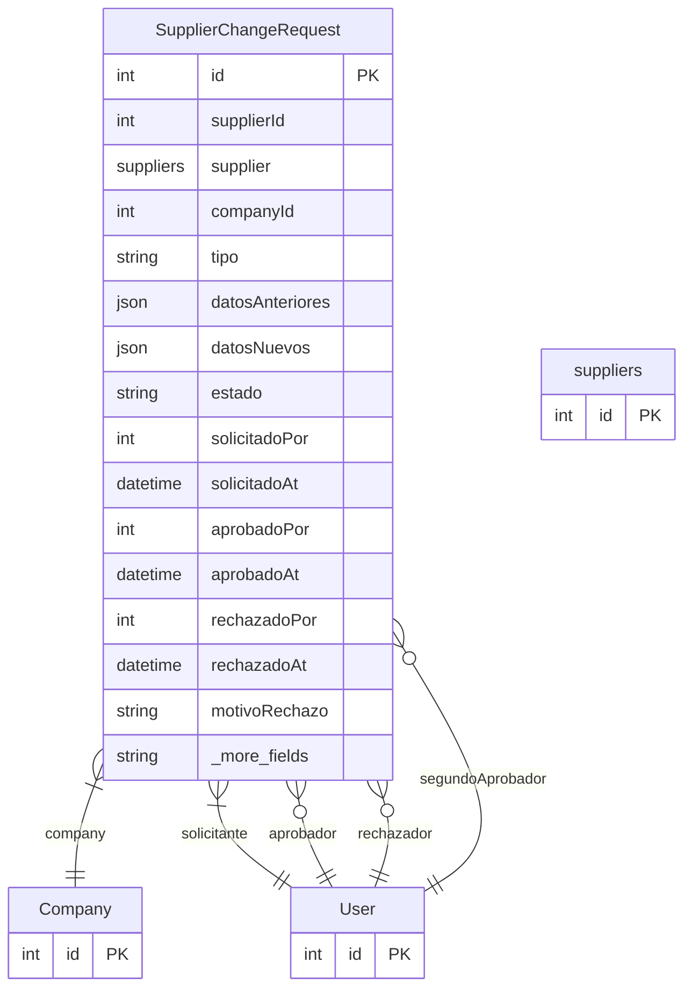

# SupplierChangeRequest

> Table name: `supplier_change_requests`

**Schema location:** Lines 3588-3629

## Fields

| Field | Type | Required | Unique | Default | Notes |
|-------|------|----------|--------|---------|-------|
| `id` | `Int` | ✅ | 🔑 PK | `autoincrement(` |  |
| `supplierId` | `Int` | ✅ |  | `` |  |
| `supplier` | `suppliers` | ✅ |  | `` |  |
| `companyId` | `Int` | ✅ |  | `` |  |
| `tipo` | `String` | ✅ |  | `` | CAMBIO_BANCARIO, CAMBIO_FISCAL, etc. |
| `datosAnteriores` | `Json` | ✅ |  | `` | Datos antes del cambio |
| `datosNuevos` | `Json` | ✅ |  | `` | Datos propuestos |
| `estado` | `String` | ✅ |  | `"PENDIENTE_APROBACION"` |  |
| `solicitadoPor` | `Int` | ✅ |  | `` | Primer solicitante/aprobador |
| `solicitadoAt` | `DateTime` | ✅ |  | `now(` |  |
| `aprobadoPor` | `Int?` | ❌ |  | `` | Primer aprobador (diferente del solicitante - SoD) |
| `aprobadoAt` | `DateTime?` | ❌ |  | `` |  |
| `rechazadoPor` | `Int?` | ❌ |  | `` | Rechazo |
| `rechazadoAt` | `DateTime?` | ❌ |  | `` |  |
| `motivoRechazo` | `String?` | ❌ |  | `` |  |
| `segundoAprobadorId` | `Int?` | ❌ |  | `` | Segundo aprobador (para doble aprobación en cambios críticos) |
| `segundaAprobacionAt` | `DateTime?` | ❌ |  | `` |  |
| `createdAt` | `DateTime` | ✅ |  | `now(` |  |
| `updatedAt` | `DateTime` | ✅ |  | `` |  |

## Relations

| Field | Type | Cardinality | FK Fields | References | On Delete |
|-------|------|-------------|-----------|------------|-----------|
| `company` | [Company](./models/Company.md) | Many-to-One | companyId | id | Cascade |
| `solicitante` | [User](./models/User.md) | Many-to-One | solicitadoPor | id | - |
| `aprobador` | [User](./models/User.md) | Many-to-One (optional) | aprobadoPor | id | - |
| `rechazador` | [User](./models/User.md) | Many-to-One (optional) | rechazadoPor | id | - |
| `segundoAprobador` | [User](./models/User.md) | Many-to-One (optional) | segundoAprobadorId | id | - |

## Referenced By

| Model | Field | Cardinality |
|-------|-------|-------------|
| [Company](./models/Company.md) | `supplierChangeRequests` | Has many |
| [User](./models/User.md) | `supplierChangeRequestsCreated` | Has many |
| [User](./models/User.md) | `supplierChangeRequestsApproved` | Has many |
| [User](./models/User.md) | `supplierChangeRequestsRejected` | Has many |
| [User](./models/User.md) | `supplierChangeRequests2Approved` | Has many |
| [suppliers](./models/suppliers.md) | `changeRequests` | Has many |

## Indexes

- `supplierId`
- `companyId, estado`

## Entity Diagram

