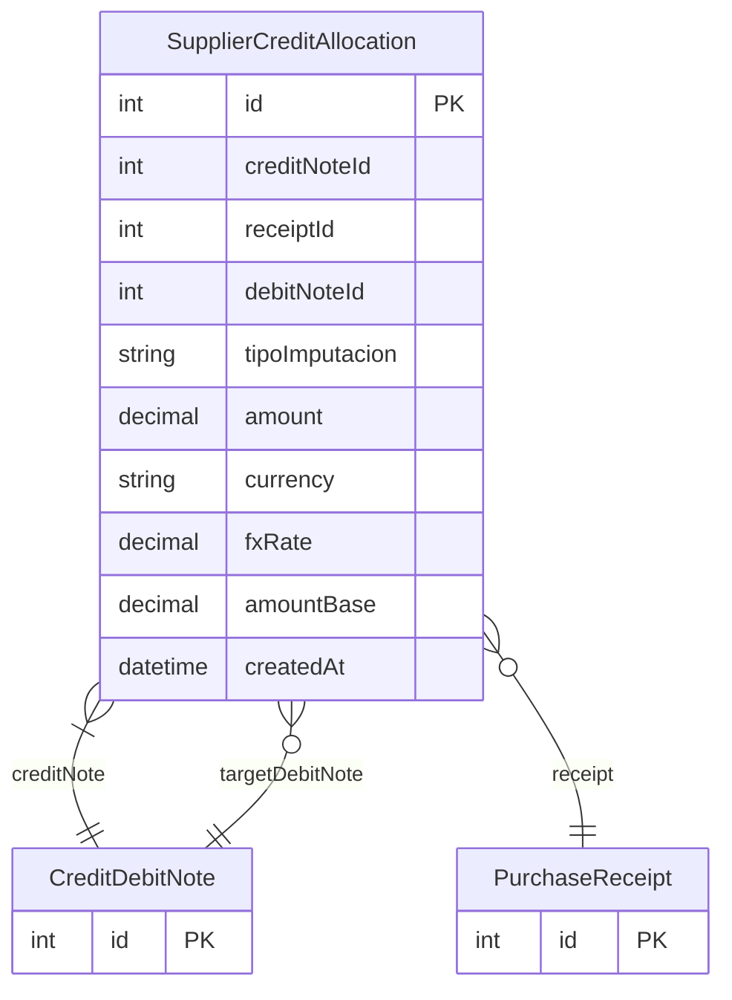

# SupplierCreditAllocation

> Table name: `supplier_credit_allocations`

**Schema location:** Lines 4928-4956

## Fields

| Field | Type | Required | Unique | Default | Notes |
|-------|------|----------|--------|---------|-------|
| `id` | `Int` | ✅ | 🔑 PK | `autoincrement(` |  |
| `creditNoteId` | `Int` | ✅ |  | `` | NCA que se está imputando |
| `receiptId` | `Int?` | ❌ |  | `` | FK a PurchaseReceipt (factura) |
| `debitNoteId` | `Int?` | ❌ |  | `` | FK a CreditDebitNote (NDA) |
| `tipoImputacion` | `String` | ✅ |  | `"FACTURA"` | DB: VarChar(20). FACTURA | NDA | SALDO_FAVOR |
| `amount` | `Decimal` | ✅ |  | `` | DB: Decimal(15, 2). Importe aplicado |
| `currency` | `String` | ✅ |  | `"ARS"` | DB: VarChar(10). Multi-moneda (escalabilidad futura) |
| `fxRate` | `Decimal?` | ❌ |  | `` | DB: Decimal(10, 6). Tipo de cambio |
| `amountBase` | `Decimal?` | ❌ |  | `` | DB: Decimal(15, 2). Importe en moneda base |
| `createdAt` | `DateTime` | ✅ |  | `now(` | Auditoría |

## Relations

| Field | Type | Cardinality | FK Fields | References | On Delete |
|-------|------|-------------|-----------|------------|-----------|
| `creditNote` | [CreditDebitNote](./models/CreditDebitNote.md) | Many-to-One | creditNoteId | id | Cascade |
| `receipt` | [PurchaseReceipt](./models/PurchaseReceipt.md) | Many-to-One (optional) | receiptId | id | - |
| `targetDebitNote` | [CreditDebitNote](./models/CreditDebitNote.md) | Many-to-One (optional) | debitNoteId | id | - |

## Referenced By

| Model | Field | Cardinality |
|-------|-------|-------------|
| [PurchaseReceipt](./models/PurchaseReceipt.md) | `creditAllocations` | Has many |
| [CreditDebitNote](./models/CreditDebitNote.md) | `creditAllocations` | Has many |
| [CreditDebitNote](./models/CreditDebitNote.md) | `debitAllocations` | Has many |

## Indexes

- `creditNoteId`
- `receiptId`
- `debitNoteId`

## Unique Constraints

- `creditNoteId, receiptId`
- `creditNoteId, debitNoteId`

## Entity Diagram

