# SupplierItem

> Table name: `SupplierItem`

**Schema location:** Lines 4739-4789

## Fields

| Field | Type | Required | Unique | Default | Notes |
|-------|------|----------|--------|---------|-------|
| `id` | `Int` | ✅ | 🔑 PK | `autoincrement(` |  |
| `supplierId` | `Int` | ✅ |  | `` |  |
| `supplyId` | `Int` | ✅ |  | `` |  |
| `nombre` | `String` | ✅ |  | `` | DB: VarChar(255) |
| `descripcion` | `String?` | ❌ |  | `` |  |
| `codigoProveedor` | `String?` | ❌ |  | `` | DB: VarChar(100) |
| `unidad` | `String` | ✅ |  | `` | DB: VarChar(50) |
| `precioUnitario` | `Decimal?` | ❌ |  | `` | DB: Decimal(15, 2) |
| `activo` | `Boolean` | ✅ |  | `true` |  |
| `companyId` | `Int` | ✅ |  | `` |  |
| `createdAt` | `DateTime` | ✅ |  | `now(` |  |
| `updatedAt` | `DateTime` | ✅ |  | `` |  |
| `supplier` | `suppliers` | ✅ |  | `` |  |
| `supply` | `supplies` | ✅ |  | `` |  |

## Relations

| Field | Type | Cardinality | FK Fields | References | On Delete |
|-------|------|-------------|-----------|------------|-----------|
| `priceHistory` | [PriceHistory](./models/PriceHistory.md) | One-to-Many | - | - | - |
| `receiptItems` | [PurchaseReceiptItem](./models/PurchaseReceiptItem.md) | One-to-Many | - | - | - |
| `stock` | [Stock](./models/Stock.md) | Many-to-One (optional) | - | - | - |
| `stockLocations` | [StockLocation](./models/StockLocation.md) | One-to-Many | - | - | - |
| `stockMovements` | [StockMovement](./models/StockMovement.md) | One-to-Many | - | - | - |
| `stockTransferItems` | [StockTransferItem](./models/StockTransferItem.md) | One-to-Many | - | - | - |
| `stockAdjustmentItems` | [StockAdjustmentItem](./models/StockAdjustmentItem.md) | One-to-Many | - | - | - |
| `purchaseOrderItems` | [PurchaseOrderItem](./models/PurchaseOrderItem.md) | One-to-Many | - | - | - |
| `goodsReceiptItems` | [GoodsReceiptItem](./models/GoodsReceiptItem.md) | One-to-Many | - | - | - |
| `creditDebitNoteItems` | [CreditDebitNoteItem](./models/CreditDebitNoteItem.md) | One-to-Many | - | - | - |
| `aliases` | [SupplierItemAlias](./models/SupplierItemAlias.md) | One-to-Many | - | - | - |
| `purchaseReturnItems` | [PurchaseReturnItem](./models/PurchaseReturnItem.md) | One-to-Many | - | - | - |
| `replenishmentSuggestions` | [ReplenishmentSuggestion](./models/ReplenishmentSuggestion.md) | One-to-Many | - | - | - |
| `supplierLeadTimes` | [SupplierLeadTime](./models/SupplierLeadTime.md) | One-to-Many | - | - | - |
| `purchaseRequestItems` | [PurchaseRequestItem](./models/PurchaseRequestItem.md) | One-to-Many | - | - | - |
| `purchaseQuotationItems` | [PurchaseQuotationItem](./models/PurchaseQuotationItem.md) | One-to-Many | - | - | - |
| `creditNoteRequestItems` | [CreditNoteRequestItem](./models/CreditNoteRequestItem.md) | One-to-Many | - | - | - |
| `stockReservations` | [StockReservation](./models/StockReservation.md) | One-to-Many | - | - | - |
| `materialRequestItems` | [MaterialRequestItem](./models/MaterialRequestItem.md) | One-to-Many | - | - | - |
| `despachoItems` | [DespachoItem](./models/DespachoItem.md) | One-to-Many | - | - | - |
| `devolucionItems` | [DevolucionMaterialItem](./models/DevolucionMaterialItem.md) | One-to-Many | - | - | - |
| `inputItems` | [InputItem](./models/InputItem.md) | One-to-Many | - | - | - |

## Referenced By

| Model | Field | Cardinality |
|-------|-------|-------------|
| [InputItem](./models/InputItem.md) | `supplierItem` | Has one |
| [suppliers](./models/suppliers.md) | `supplierItems` | Has many |
| [supplies](./models/supplies.md) | `supplierItems` | Has many |
| [PurchaseReceiptItem](./models/PurchaseReceiptItem.md) | `supplierItem` | Has one |
| [PriceHistory](./models/PriceHistory.md) | `supplierItem` | Has one |
| [Stock](./models/Stock.md) | `supplierItem` | Has one |
| [StockLocation](./models/StockLocation.md) | `supplierItem` | Has one |
| [StockMovement](./models/StockMovement.md) | `supplierItem` | Has one |
| [StockTransferItem](./models/StockTransferItem.md) | `supplierItem` | Has one |
| [StockAdjustmentItem](./models/StockAdjustmentItem.md) | `supplierItem` | Has one |
| [PurchaseOrderItem](./models/PurchaseOrderItem.md) | `supplierItem` | Has one |
| [GoodsReceiptItem](./models/GoodsReceiptItem.md) | `supplierItem` | Has one |
| [CreditDebitNoteItem](./models/CreditDebitNoteItem.md) | `supplierItem` | Has one |
| [CreditNoteRequestItem](./models/CreditNoteRequestItem.md) | `supplierItem` | Has one |
| [SupplierItemAlias](./models/SupplierItemAlias.md) | `supplierItem` | Has one |
| [PurchaseReturnItem](./models/PurchaseReturnItem.md) | `supplierItem` | Has one |
| [ReplenishmentSuggestion](./models/ReplenishmentSuggestion.md) | `supplierItem` | Has one |
| [SupplierLeadTime](./models/SupplierLeadTime.md) | `supplierItem` | Has one |
| [PurchaseRequestItem](./models/PurchaseRequestItem.md) | `supplierItem` | Has one |
| [PurchaseQuotationItem](./models/PurchaseQuotationItem.md) | `supplierItem` | Has one |
| [StockReservation](./models/StockReservation.md) | `supplierItem` | Has one |
| [MaterialRequestItem](./models/MaterialRequestItem.md) | `supplierItem` | Has one |
| [DespachoItem](./models/DespachoItem.md) | `supplierItem` | Has one |
| [DevolucionMaterialItem](./models/DevolucionMaterialItem.md) | `supplierItem` | Has one |

## Indexes

- `supplierId, codigoProveedor`
- `supplierId`
- `supplyId`
- `companyId`
- `activo`

## Unique Constraints

- `supplierId, supplyId`

## Entity Diagram

```mermaid
erDiagram
    SupplierItem {
        int id PK
        int supplierId
        int supplyId
        string nombre
        string descripcion
        string codigoProveedor
        string unidad
        decimal precioUnitario
        boolean activo
        int companyId
        datetime createdAt
        datetime updatedAt
        suppliers supplier
        supplies supply
    }
    PriceHistory {
        int id PK
    }
    PurchaseReceiptItem {
        int id PK
    }
    Stock {
        int id PK
    }
    StockLocation {
        int id PK
    }
    StockMovement {
        int id PK
    }
    StockTransferItem {
        int id PK
    }
    StockAdjustmentItem {
        int id PK
    }
    PurchaseOrderItem {
        int id PK
    }
    GoodsReceiptItem {
        int id PK
    }
    CreditDebitNoteItem {
        int id PK
    }
    SupplierItemAlias {
        int id PK
    }
    PurchaseReturnItem {
        int id PK
    }
    ReplenishmentSuggestion {
        int id PK
    }
    SupplierLeadTime {
        int id PK
    }
    PurchaseRequestItem {
        int id PK
    }
    PurchaseQuotationItem {
        int id PK
    }
    CreditNoteRequestItem {
        int id PK
    }
    StockReservation {
        int id PK
    }
    MaterialRequestItem {
        int id PK
    }
    DespachoItem {
        int id PK
    }
    DevolucionMaterialItem {
        int id PK
    }
    InputItem {
        string id PK
    }
    suppliers {
        int id PK
    }
    supplies {
        int id PK
    }
    SupplierItem ||--o{ PriceHistory : "priceHistory"
    SupplierItem ||--o{ PurchaseReceiptItem : "receiptItems"
    SupplierItem }o--|| Stock : "stock"
    SupplierItem ||--o{ StockLocation : "stockLocations"
    SupplierItem ||--o{ StockMovement : "stockMovements"
    SupplierItem ||--o{ StockTransferItem : "stockTransferItems"
    SupplierItem ||--o{ StockAdjustmentItem : "stockAdjustmentItems"
    SupplierItem ||--o{ PurchaseOrderItem : "purchaseOrderItems"
    SupplierItem ||--o{ GoodsReceiptItem : "goodsReceiptItems"
    SupplierItem ||--o{ CreditDebitNoteItem : "creditDebitNoteItems"
    SupplierItem ||--o{ SupplierItemAlias : "aliases"
    SupplierItem ||--o{ PurchaseReturnItem : "purchaseReturnItems"
    SupplierItem ||--o{ ReplenishmentSuggestion : "replenishmentSuggestions"
    SupplierItem ||--o{ SupplierLeadTime : "supplierLeadTimes"
    SupplierItem ||--o{ PurchaseRequestItem : "purchaseRequestItems"
    SupplierItem ||--o{ PurchaseQuotationItem : "purchaseQuotationItems"
    SupplierItem ||--o{ CreditNoteRequestItem : "creditNoteRequestItems"
    SupplierItem ||--o{ StockReservation : "stockReservations"
    SupplierItem ||--o{ MaterialRequestItem : "materialRequestItems"
    SupplierItem ||--o{ DespachoItem : "despachoItems"
    SupplierItem ||--o{ DevolucionMaterialItem : "devolucionItems"
    SupplierItem ||--o{ InputItem : "inputItems"
```

