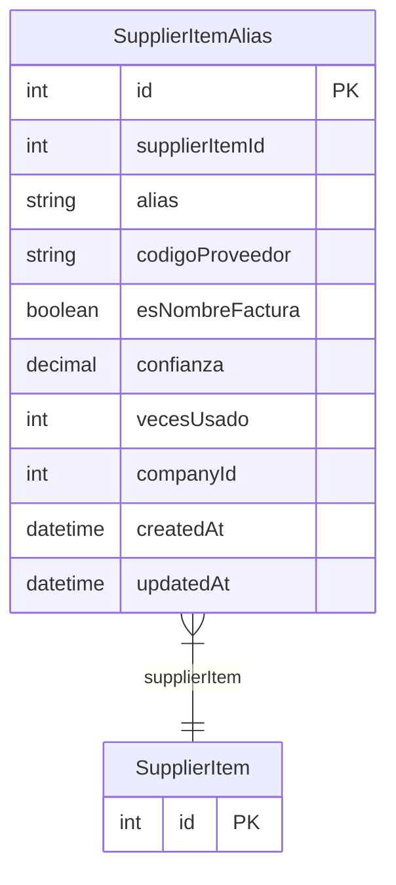

# SupplierItemAlias

> Table name: `supplier_item_aliases`

**Schema location:** Lines 7338-7357

## Fields

| Field | Type | Required | Unique | Default | Notes |
|-------|------|----------|--------|---------|-------|
| `id` | `Int` | ✅ | 🔑 PK | `autoincrement(` |  |
| `supplierItemId` | `Int` | ✅ |  | `` |  |
| `alias` | `String` | ✅ |  | `` | DB: VarChar(255) |
| `codigoProveedor` | `String?` | ❌ |  | `` | DB: VarChar(100). Código del proveedor para este alias |
| `esNombreFactura` | `Boolean` | ✅ |  | `true` | Si es el nombre que aparece en facturas |
| `confianza` | `Decimal` | ✅ |  | `100` | DB: Decimal(5, 2). % de confianza del alias |
| `vecesUsado` | `Int` | ✅ |  | `0` | Veces que se usó este alias |
| `companyId` | `Int` | ✅ |  | `` |  |
| `createdAt` | `DateTime` | ✅ |  | `now(` |  |
| `updatedAt` | `DateTime` | ✅ |  | `` |  |

## Relations

| Field | Type | Cardinality | FK Fields | References | On Delete |
|-------|------|-------------|-----------|------------|-----------|
| `supplierItem` | [SupplierItem](./models/SupplierItem.md) | Many-to-One | supplierItemId | id | Cascade |

## Referenced By

| Model | Field | Cardinality |
|-------|-------|-------------|
| [SupplierItem](./models/SupplierItem.md) | `aliases` | Has many |

## Indexes

- `supplierItemId`
- `alias`
- `codigoProveedor`
- `companyId`

## Entity Diagram

