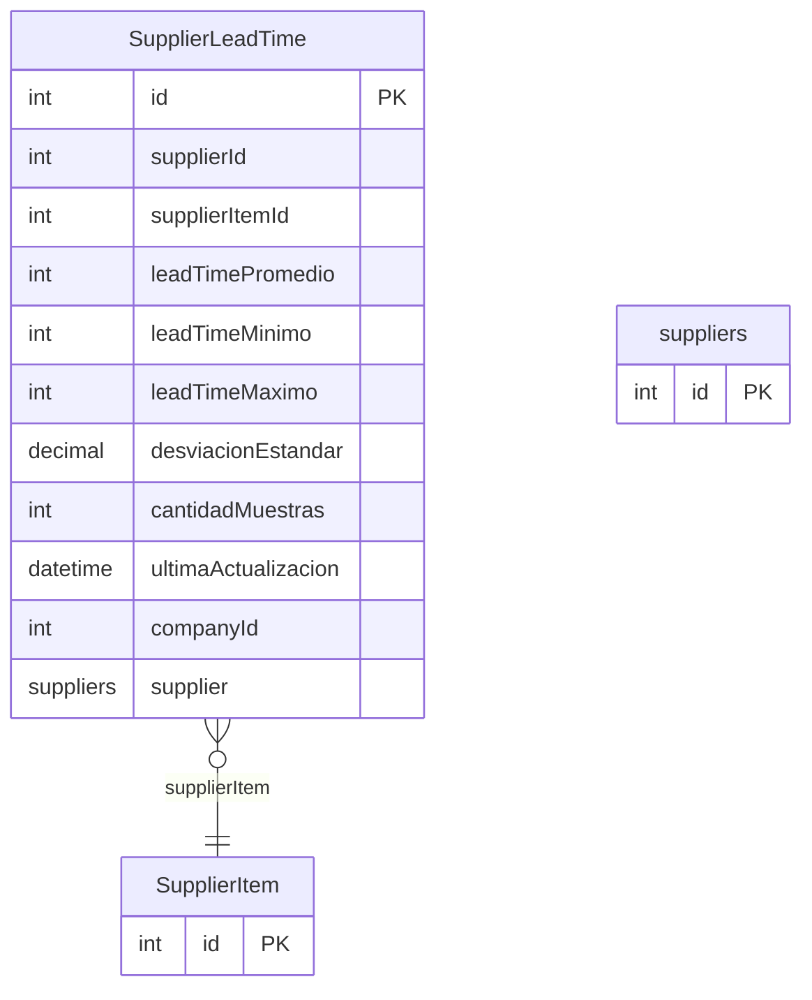

# SupplierLeadTime

> Table name: `supplier_lead_times`

**Schema location:** Lines 7618-7637

## Fields

| Field | Type | Required | Unique | Default | Notes |
|-------|------|----------|--------|---------|-------|
| `id` | `Int` | ✅ | 🔑 PK | `autoincrement(` |  |
| `supplierId` | `Int` | ✅ |  | `` |  |
| `supplierItemId` | `Int?` | ❌ |  | `` | Opcional: lead time específico por item |
| `leadTimePromedio` | `Int` | ✅ |  | `` | Días promedio |
| `leadTimeMinimo` | `Int?` | ❌ |  | `` |  |
| `leadTimeMaximo` | `Int?` | ❌ |  | `` |  |
| `desviacionEstandar` | `Decimal?` | ❌ |  | `` | DB: Decimal(5, 2) |
| `cantidadMuestras` | `Int` | ✅ |  | `0` |  |
| `ultimaActualizacion` | `DateTime` | ✅ |  | `now(` |  |
| `companyId` | `Int` | ✅ |  | `` |  |
| `supplier` | `suppliers` | ✅ |  | `` |  |

## Relations

| Field | Type | Cardinality | FK Fields | References | On Delete |
|-------|------|-------------|-----------|------------|-----------|
| `supplierItem` | [SupplierItem](./models/SupplierItem.md) | Many-to-One (optional) | supplierItemId | id | - |

## Referenced By

| Model | Field | Cardinality |
|-------|-------|-------------|
| [suppliers](./models/suppliers.md) | `supplierLeadTimes` | Has many |
| [SupplierItem](./models/SupplierItem.md) | `supplierLeadTimes` | Has many |

## Indexes

- `companyId`
- `supplierId`

## Unique Constraints

- `supplierId, supplierItemId`

## Entity Diagram

