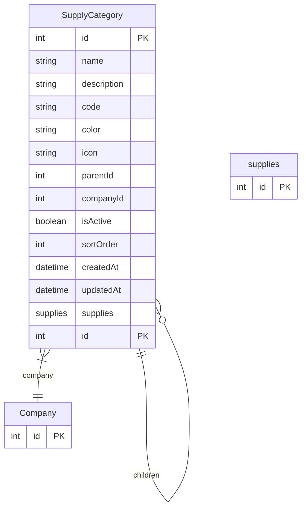

# SupplyCategory

> Table name: `supply_categories`

**Schema location:** Lines 3635-3659

## Fields

| Field | Type | Required | Unique | Default | Notes |
|-------|------|----------|--------|---------|-------|
| `id` | `Int` | ✅ | 🔑 PK | `autoincrement(` |  |
| `name` | `String` | ✅ |  | `` | DB: VarChar(100). Rodamientos, Electricidad, Lubricantes, etc. |
| `description` | `String?` | ❌ |  | `` |  |
| `code` | `String?` | ❌ |  | `` | DB: VarChar(20). Código opcional (ROD, ELE, LUB) |
| `color` | `String?` | ❌ |  | `` | DB: VarChar(7). Color hex para UI (#FF5733) |
| `icon` | `String?` | ❌ |  | `` | DB: VarChar(50). Nombre del icono (cog, zap, droplet) |
| `parentId` | `Int?` | ❌ |  | `` | Para subcategorías |
| `companyId` | `Int` | ✅ |  | `` |  |
| `isActive` | `Boolean` | ✅ |  | `true` |  |
| `sortOrder` | `Int` | ✅ |  | `0` | Para ordenar en listas |
| `createdAt` | `DateTime` | ✅ |  | `now(` |  |
| `updatedAt` | `DateTime` | ✅ |  | `` |  |
| `supplies` | `supplies[]` | ✅ |  | `` |  |

## Relations

| Field | Type | Cardinality | FK Fields | References | On Delete |
|-------|------|-------------|-----------|------------|-----------|
| `company` | [Company](./models/Company.md) | Many-to-One | companyId | id | Cascade |
| `parent` | [SupplyCategory](./models/SupplyCategory.md) | Many-to-One (optional) | parentId | id | SetNull |
| `children` | [SupplyCategory](./models/SupplyCategory.md) | One-to-Many | - | - | - |

## Referenced By

| Model | Field | Cardinality |
|-------|-------|-------------|
| [Company](./models/Company.md) | `supplyCategories` | Has many |
| [supplies](./models/supplies.md) | `category` | Has one |

## Indexes

- `parentId`
- `companyId, isActive`

## Unique Constraints

- `companyId, name`
- `companyId, code`

## Entity Diagram

