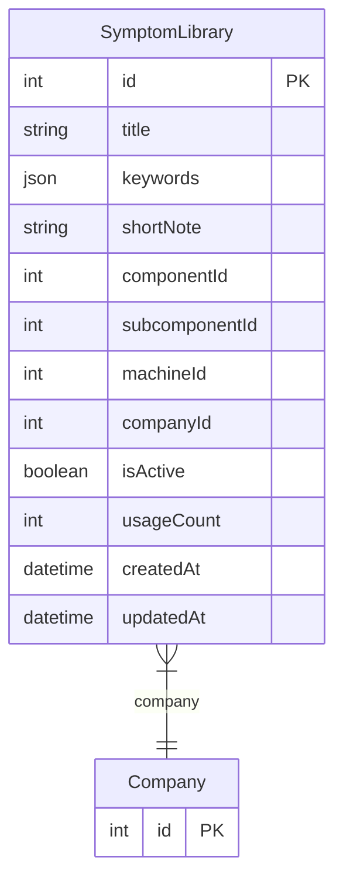

# SymptomLibrary

> Table name: `symptom_library`

**Schema location:** Lines 5531-5550

## Fields

| Field | Type | Required | Unique | Default | Notes |
|-------|------|----------|--------|---------|-------|
| `id` | `Int` | ✅ | 🔑 PK | `autoincrement(` |  |
| `title` | `String` | ✅ |  | `` | DB: VarChar(100) |
| `keywords` | `Json` | ✅ |  | `` | MySQL compatible: ["ruido", "vibración", "caliente"] |
| `shortNote` | `String?` | ❌ |  | `` | DB: VarChar(255) |
| `componentId` | `Int?` | ❌ |  | `` |  |
| `subcomponentId` | `Int?` | ❌ |  | `` |  |
| `machineId` | `Int?` | ❌ |  | `` |  |
| `companyId` | `Int` | ✅ |  | `` |  |
| `isActive` | `Boolean` | ✅ |  | `true` |  |
| `usageCount` | `Int` | ✅ |  | `0` |  |
| `createdAt` | `DateTime` | ✅ |  | `now(` |  |
| `updatedAt` | `DateTime` | ✅ |  | `` |  |

## Relations

| Field | Type | Cardinality | FK Fields | References | On Delete |
|-------|------|-------------|-----------|------------|-----------|
| `company` | [Company](./models/Company.md) | Many-to-One | companyId | id | Cascade |

## Referenced By

| Model | Field | Cardinality |
|-------|-------|-------------|
| [Company](./models/Company.md) | `symptomLibrary` | Has many |

## Indexes

- `companyId, componentId`
- `companyId, subcomponentId`

## Entity Diagram

