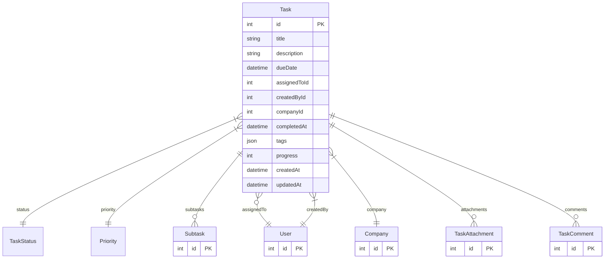

# Task

> Table name: `Task`

**Schema location:** Lines 1899-1922

## Fields

| Field | Type | Required | Unique | Default | Notes |
|-------|------|----------|--------|---------|-------|
| `id` | `Int` | ✅ | 🔑 PK | `autoincrement(` |  |
| `title` | `String` | ✅ |  | `` |  |
| `description` | `String?` | ❌ |  | `` |  |
| `dueDate` | `DateTime?` | ❌ |  | `` |  |
| `assignedToId` | `Int?` | ❌ |  | `` |  |
| `createdById` | `Int` | ✅ |  | `` |  |
| `companyId` | `Int` | ✅ |  | `` |  |
| `completedAt` | `DateTime?` | ❌ |  | `` |  |
| `tags` | `Json?` | ❌ |  | `` |  |
| `progress` | `Int` | ✅ |  | `0` |  |
| `createdAt` | `DateTime` | ✅ |  | `now(` |  |
| `updatedAt` | `DateTime` | ✅ |  | `` |  |

## Relations

| Field | Type | Cardinality | FK Fields | References | On Delete |
|-------|------|-------------|-----------|------------|-----------|
| `status` | [TaskStatus](./models/TaskStatus.md) | Many-to-One | - | - | - |
| `priority` | [Priority](./models/Priority.md) | Many-to-One | - | - | - |
| `subtasks` | [Subtask](./models/Subtask.md) | One-to-Many | - | - | - |
| `assignedTo` | [User](./models/User.md) | Many-to-One (optional) | assignedToId | id | - |
| `company` | [Company](./models/Company.md) | Many-to-One | companyId | id | Cascade |
| `createdBy` | [User](./models/User.md) | Many-to-One | createdById | id | - |
| `attachments` | [TaskAttachment](./models/TaskAttachment.md) | One-to-Many | - | - | - |
| `comments` | [TaskComment](./models/TaskComment.md) | One-to-Many | - | - | - |

## Referenced By

| Model | Field | Cardinality |
|-------|-------|-------------|
| [Company](./models/Company.md) | `tasks` | Has many |
| [User](./models/User.md) | `assignedTasks` | Has many |
| [User](./models/User.md) | `createdTasks` | Has many |
| [TaskAttachment](./models/TaskAttachment.md) | `task` | Has one |
| [Subtask](./models/Subtask.md) | `task` | Has one |
| [TaskComment](./models/TaskComment.md) | `task` | Has one |

## Entity Diagram

