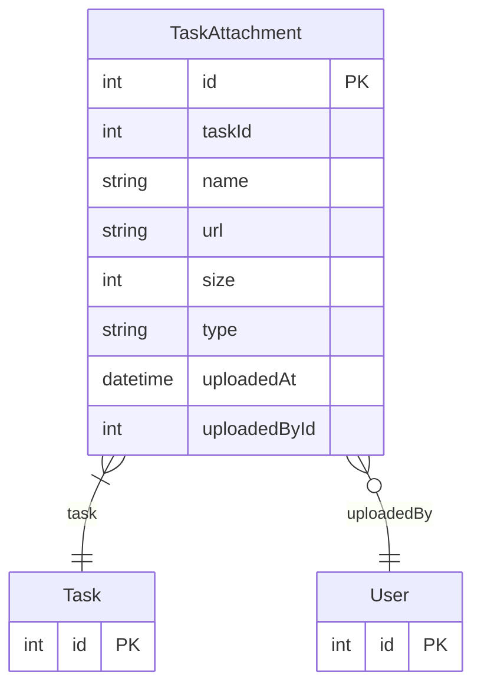

# TaskAttachment

> Table name: `TaskAttachment`

**Schema location:** Lines 1924-1937

## Fields

| Field | Type | Required | Unique | Default | Notes |
|-------|------|----------|--------|---------|-------|
| `id` | `Int` | ✅ | 🔑 PK | `autoincrement(` |  |
| `taskId` | `Int` | ✅ |  | `` |  |
| `name` | `String` | ✅ |  | `` |  |
| `url` | `String` | ✅ |  | `` |  |
| `size` | `Int?` | ❌ |  | `` |  |
| `type` | `String?` | ❌ |  | `` |  |
| `uploadedAt` | `DateTime` | ✅ |  | `now(` |  |
| `uploadedById` | `Int?` | ❌ |  | `` |  |

## Relations

| Field | Type | Cardinality | FK Fields | References | On Delete |
|-------|------|-------------|-----------|------------|-----------|
| `task` | [Task](./models/Task.md) | Many-to-One | taskId | id | Cascade |
| `uploadedBy` | [User](./models/User.md) | Many-to-One (optional) | uploadedById | id | - |

## Referenced By

| Model | Field | Cardinality |
|-------|-------|-------------|
| [User](./models/User.md) | `taskAttachments` | Has many |
| [Task](./models/Task.md) | `attachments` | Has many |

## Entity Diagram

