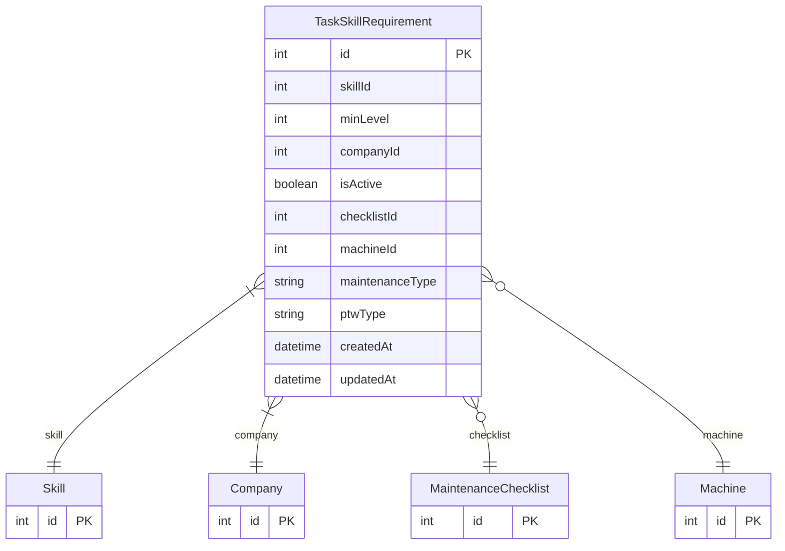

# TaskSkillRequirement

> Table name: `task_skill_requirements`

**Schema location:** Lines 13178-13206

## Fields

| Field | Type | Required | Unique | Default | Notes |
|-------|------|----------|--------|---------|-------|
| `id` | `Int` | ✅ | 🔑 PK | `autoincrement(` |  |
| `skillId` | `Int` | ✅ |  | `` |  |
| `minLevel` | `Int` | ✅ |  | `1` | Nivel mínimo requerido (1-5) |
| `companyId` | `Int` | ✅ |  | `` |  |
| `isActive` | `Boolean` | ✅ |  | `true` |  |
| `checklistId` | `Int?` | ❌ |  | `` | Requerido para ejecutar este checklist |
| `machineId` | `Int?` | ❌ |  | `` | Requerido para trabajar en esta máquina |
| `maintenanceType` | `String?` | ❌ |  | `` | Requerido para este tipo de mantenimiento |
| `ptwType` | `String?` | ❌ |  | `` | Requerido para este tipo de PTW (castear a PTWType) |
| `createdAt` | `DateTime` | ✅ |  | `now(` |  |
| `updatedAt` | `DateTime` | ✅ |  | `` |  |

## Relations

| Field | Type | Cardinality | FK Fields | References | On Delete |
|-------|------|-------------|-----------|------------|-----------|
| `skill` | [Skill](./models/Skill.md) | Many-to-One | skillId | id | Cascade |
| `company` | [Company](./models/Company.md) | Many-to-One | companyId | id | Cascade |
| `checklist` | [MaintenanceChecklist](./models/MaintenanceChecklist.md) | Many-to-One (optional) | checklistId | id | Cascade |
| `machine` | [Machine](./models/Machine.md) | Many-to-One (optional) | machineId | id | Cascade |

## Referenced By

| Model | Field | Cardinality |
|-------|-------|-------------|
| [Company](./models/Company.md) | `taskSkillRequirements` | Has many |
| [Machine](./models/Machine.md) | `skillRequirements` | Has many |
| [MaintenanceChecklist](./models/MaintenanceChecklist.md) | `skillRequirements` | Has many |
| [Skill](./models/Skill.md) | `taskRequirements` | Has many |

## Indexes

- `skillId`
- `companyId`
- `checklistId`
- `machineId`
- `maintenanceType`

## Entity Diagram

