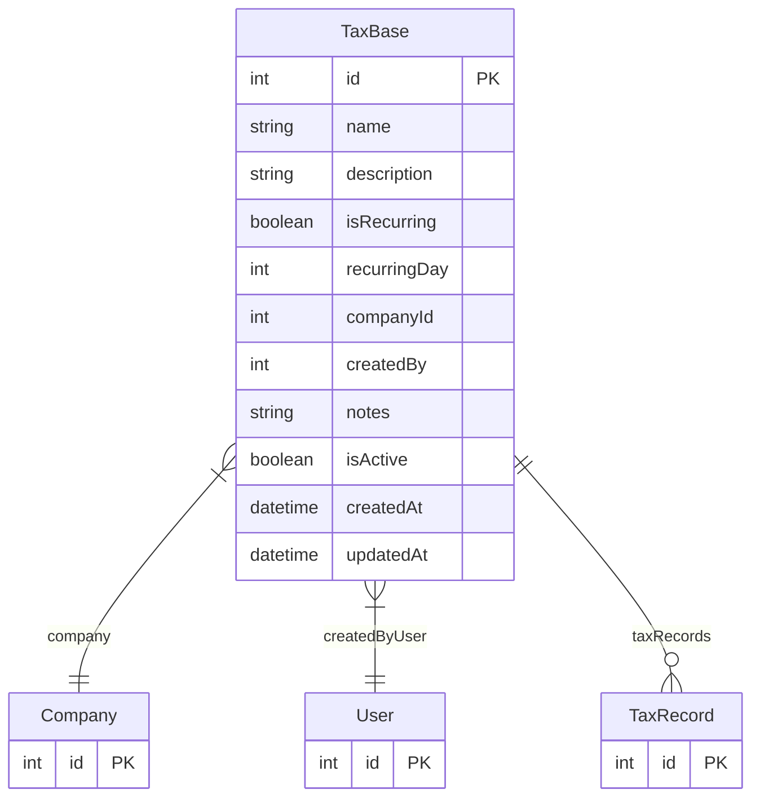

# TaxBase

> Table name: `TaxBase`

**Schema location:** Lines 4005-4025

## Fields

| Field | Type | Required | Unique | Default | Notes |
|-------|------|----------|--------|---------|-------|
| `id` | `Int` | ✅ | 🔑 PK | `autoincrement(` |  |
| `name` | `String` | ✅ |  | `` | DB: VarChar(255) |
| `description` | `String?` | ❌ |  | `` |  |
| `isRecurring` | `Boolean` | ✅ |  | `true` |  |
| `recurringDay` | `Int` | ✅ |  | `` |  |
| `companyId` | `Int` | ✅ |  | `` |  |
| `createdBy` | `Int` | ✅ |  | `` |  |
| `notes` | `String?` | ❌ |  | `` |  |
| `isActive` | `Boolean` | ✅ |  | `true` |  |
| `createdAt` | `DateTime` | ✅ |  | `now(` |  |
| `updatedAt` | `DateTime` | ✅ |  | `now(` |  |

## Relations

| Field | Type | Cardinality | FK Fields | References | On Delete |
|-------|------|-------------|-----------|------------|-----------|
| `company` | [Company](./models/Company.md) | Many-to-One | companyId | id | Cascade |
| `createdByUser` | [User](./models/User.md) | Many-to-One | createdBy | id | - |
| `taxRecords` | [TaxRecord](./models/TaxRecord.md) | One-to-Many | - | - | - |

## Referenced By

| Model | Field | Cardinality |
|-------|-------|-------------|
| [Company](./models/Company.md) | `taxBases` | Has many |
| [User](./models/User.md) | `taxBasesCreated` | Has many |
| [TaxRecord](./models/TaxRecord.md) | `taxBase` | Has one |

## Indexes

- `companyId`
- `isActive`
- `isRecurring, recurringDay`

## Entity Diagram

