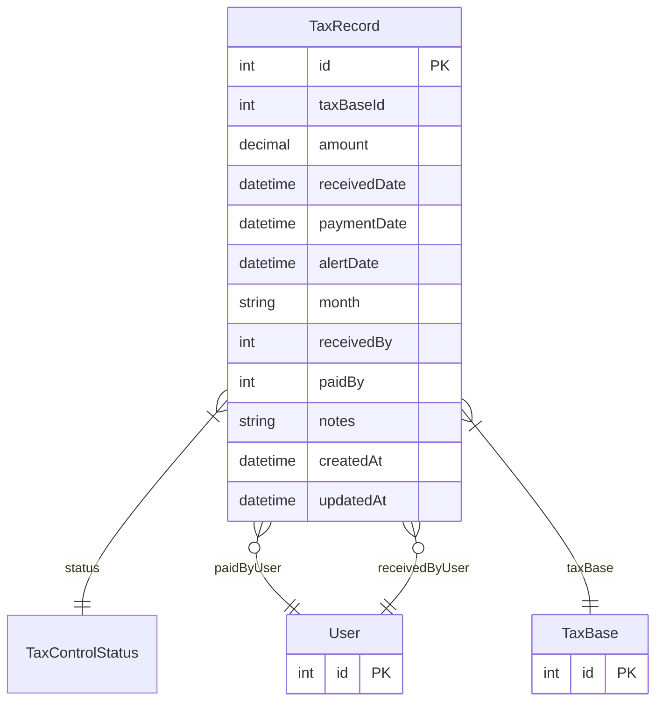

# TaxRecord

> Table name: `TaxRecord`

**Schema location:** Lines 4027-4051

## Fields

| Field | Type | Required | Unique | Default | Notes |
|-------|------|----------|--------|---------|-------|
| `id` | `Int` | ✅ | 🔑 PK | `autoincrement(` |  |
| `taxBaseId` | `Int` | ✅ |  | `` |  |
| `amount` | `Decimal` | ✅ |  | `` | DB: Decimal(15, 2) |
| `receivedDate` | `DateTime?` | ❌ |  | `` |  |
| `paymentDate` | `DateTime?` | ❌ |  | `` |  |
| `alertDate` | `DateTime` | ✅ |  | `` |  |
| `month` | `String` | ✅ |  | `` | DB: VarChar(7) |
| `receivedBy` | `Int?` | ❌ |  | `` |  |
| `paidBy` | `Int?` | ❌ |  | `` |  |
| `notes` | `String?` | ❌ |  | `` |  |
| `createdAt` | `DateTime` | ✅ |  | `now(` |  |
| `updatedAt` | `DateTime` | ✅ |  | `now(` |  |

## Relations

| Field | Type | Cardinality | FK Fields | References | On Delete |
|-------|------|-------------|-----------|------------|-----------|
| `status` | [TaxControlStatus](./models/TaxControlStatus.md) | Many-to-One | - | - | - |
| `paidByUser` | [User](./models/User.md) | Many-to-One (optional) | paidBy | id | - |
| `receivedByUser` | [User](./models/User.md) | Many-to-One (optional) | receivedBy | id | - |
| `taxBase` | [TaxBase](./models/TaxBase.md) | Many-to-One | taxBaseId | id | Cascade |

## Referenced By

| Model | Field | Cardinality |
|-------|-------|-------------|
| [User](./models/User.md) | `taxRecordsPaid` | Has many |
| [User](./models/User.md) | `taxRecordsReceived` | Has many |
| [TaxBase](./models/TaxBase.md) | `taxRecords` | Has many |

## Indexes

- `taxBaseId`
- `status`
- `alertDate`
- `month`

## Unique Constraints

- `taxBaseId, month`

## Entity Diagram

