# TechnicianCostRate

> Table name: `technician_cost_rates`

**Schema location:** Lines 12384-12408

## Fields

| Field | Type | Required | Unique | Default | Notes |
|-------|------|----------|--------|---------|-------|
| `id` | `Int` | ✅ | 🔑 PK | `autoincrement(` |  |
| `userId` | `Int` | ✅ |  | `` |  |
| `companyId` | `Int` | ✅ |  | `` |  |
| `hourlyRate` | `Decimal` | ✅ |  | `` | DB: Decimal(10, 2). Tarifa normal por hora |
| `overtimeRate` | `Decimal?` | ❌ |  | `` | DB: Decimal(10, 2). Tarifa horas extra (opcional) |
| `role` | `String?` | ❌ |  | `` | Rol o especialidad del técnico |
| `currency` | `String` | ✅ |  | `"ARS"` |  |
| `isActive` | `Boolean` | ✅ |  | `true` |  |
| `effectiveFrom` | `DateTime` | ✅ |  | `now(` |  |
| `effectiveTo` | `DateTime?` | ❌ |  | `` |  |
| `createdAt` | `DateTime` | ✅ |  | `now(` |  |
| `updatedAt` | `DateTime` | ✅ |  | `` |  |

## Relations

| Field | Type | Cardinality | FK Fields | References | On Delete |
|-------|------|-------------|-----------|------------|-----------|
| `user` | [User](./models/User.md) | Many-to-One | userId | id | Cascade |
| `company` | [Company](./models/Company.md) | Many-to-One | companyId | id | Cascade |

## Referenced By

| Model | Field | Cardinality |
|-------|-------|-------------|
| [Company](./models/Company.md) | `technicianCostRates` | Has many |
| [User](./models/User.md) | `technicianCostRates` | Has many |

## Indexes

- `companyId, isActive`

## Unique Constraints

- `userId, companyId, effectiveFrom`

## Entity Diagram

```mermaid
erDiagram
    TechnicianCostRate {
        int id PK
        int userId
        int companyId
        decimal hourlyRate
        decimal overtimeRate
        string role
        string currency
        boolean isActive
        datetime effectiveFrom
        datetime effectiveTo
        datetime createdAt
        datetime updatedAt
    }
    User {
        int id PK
    }
    Company {
        int id PK
    }
    TechnicianCostRate }|--|| User : "user"
    TechnicianCostRate }|--|| Company : "company"
```

