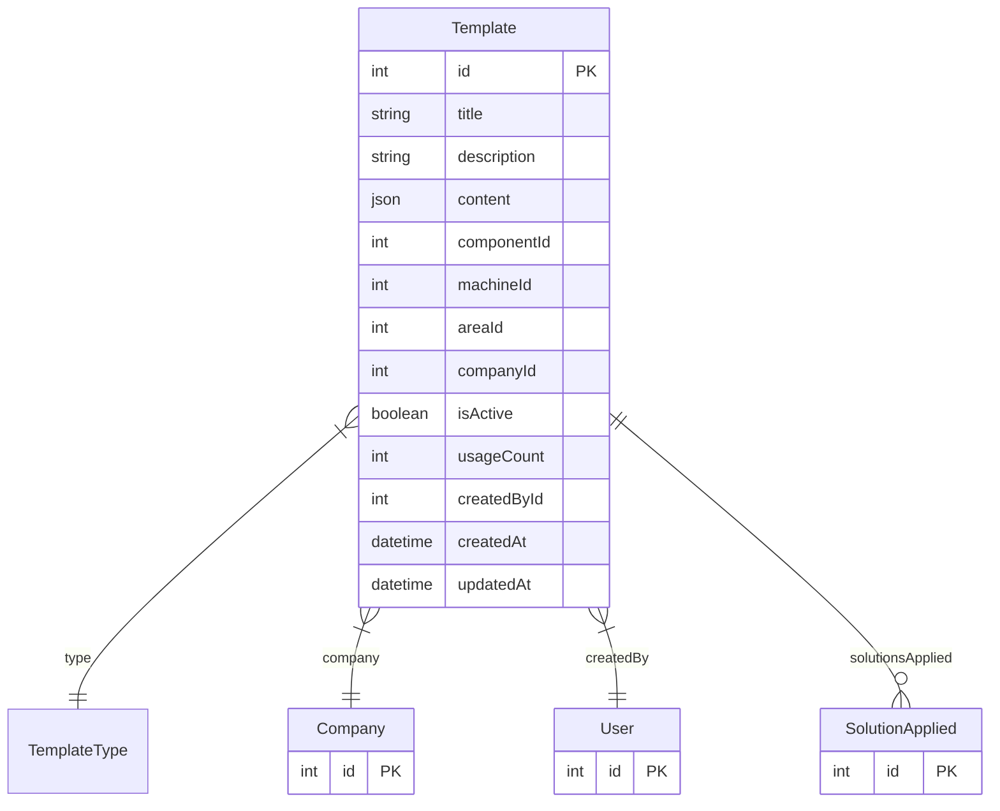

# Template

> Table name: `templates`

**Schema location:** Lines 5607-5630

## Fields

| Field | Type | Required | Unique | Default | Notes |
|-------|------|----------|--------|---------|-------|
| `id` | `Int` | ✅ | 🔑 PK | `autoincrement(` |  |
| `title` | `String` | ✅ |  | `` | DB: VarChar(255) |
| `description` | `String?` | ❌ |  | `` |  |
| `content` | `Json` | ✅ |  | `` | Estructura de la plantilla |
| `componentId` | `Int?` | ❌ |  | `` |  |
| `machineId` | `Int?` | ❌ |  | `` |  |
| `areaId` | `Int?` | ❌ |  | `` |  |
| `companyId` | `Int` | ✅ |  | `` |  |
| `isActive` | `Boolean` | ✅ |  | `true` |  |
| `usageCount` | `Int` | ✅ |  | `0` |  |
| `createdById` | `Int` | ✅ |  | `` |  |
| `createdAt` | `DateTime` | ✅ |  | `now(` |  |
| `updatedAt` | `DateTime` | ✅ |  | `` |  |

## Relations

| Field | Type | Cardinality | FK Fields | References | On Delete |
|-------|------|-------------|-----------|------------|-----------|
| `type` | [TemplateType](./models/TemplateType.md) | Many-to-One | - | - | - |
| `company` | [Company](./models/Company.md) | Many-to-One | companyId | id | Cascade |
| `createdBy` | [User](./models/User.md) | Many-to-One | createdById | id | - |
| `solutionsApplied` | [SolutionApplied](./models/SolutionApplied.md) | One-to-Many | - | - | - |

## Referenced By

| Model | Field | Cardinality |
|-------|-------|-------------|
| [Company](./models/Company.md) | `templates` | Has many |
| [User](./models/User.md) | `templatesCreated` | Has many |
| [SolutionApplied](./models/SolutionApplied.md) | `template` | Has one |

## Indexes

- `companyId, type`
- `componentId`

## Entity Diagram

